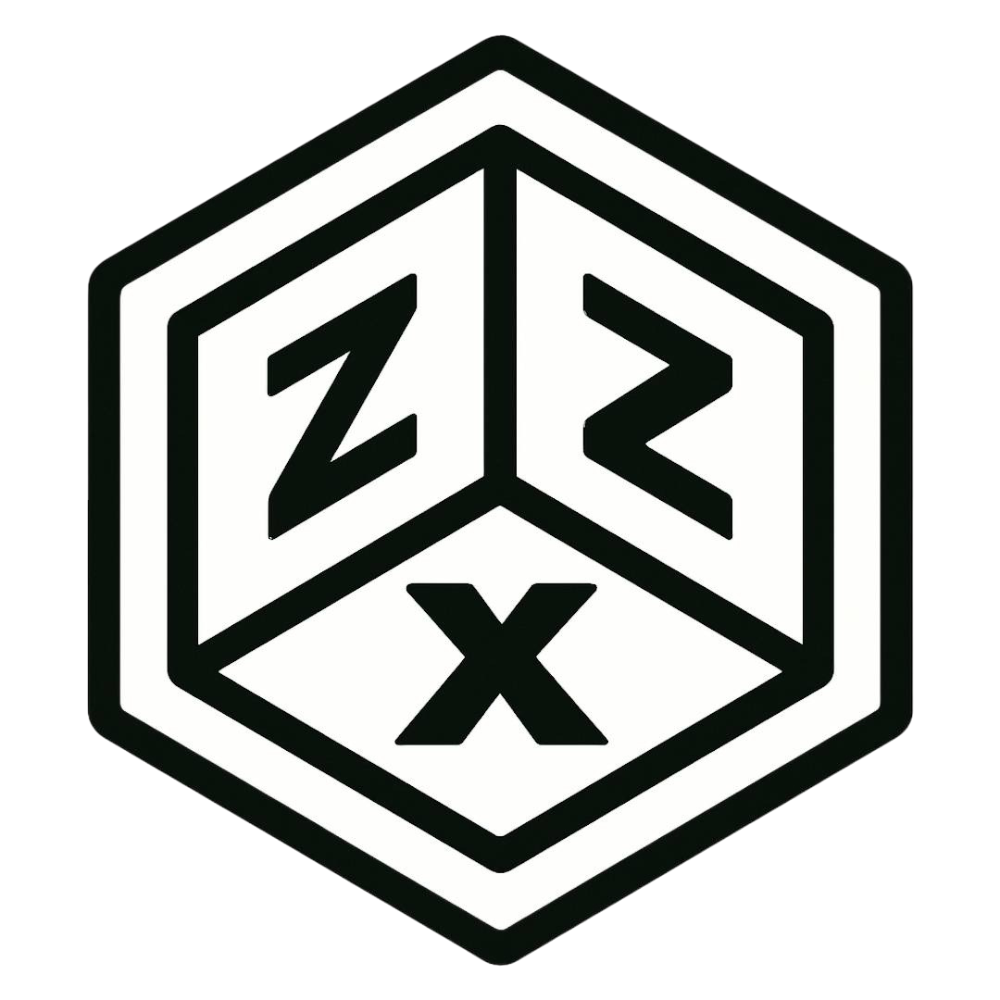

<div align="center">



# Projects


A list of all projects across all areas.


**Version:** 0.1.0-alpha  
**License:** MIT  
**Author:** [0xdeadbeef] of ZZX-Labs R&D  
**Languages:** Python 3.11+

</div>


## What it does

- _


## Install

_


## Run (GUI)

_


## Run (CLI)

_


## Math

_


---

## Directory layout

```
projects/
├─ README.md
├─ LICENSE
├─ index.html
├─ manifest.json
├─ style.css
├─ script.js
├─ hook.js
├─ hook.css
├─ logo.png
├─ firmware/
|   ├─ _/
|   ├─ README.md
|   ├─ index.html
|   ├─ manifest.json
|   ├─ style.css
|   ├─ script.js
|   ├─ hook.js
|   ├─ hook.css
|   └─ logo.png
├─ hardware/
|   ├─ bit-tick/
|   ├─ README.md
|   ├─ index.html
|   ├─ manifest.json
|   ├─ style.css
|   ├─ script.js
|   ├─ hook.js
|   ├─ hook.css
|   └─ logo.png
├─ software/
|   ├─ 4-4/
|   ├─ aipdabe/
|   ├─ _/
|   ├─ _/
|   ├─ README.md
|   ├─ index.html
|   ├─ manifest.json
|   ├─ style.css
|   ├─ script.js
|   ├─ hook.js
|   ├─ hook.css
|   └─ logo.png
└─ web/
   ├─ bit-tick/
   ├─ isan/
   ├─ isrn/
   ├─ istv/
   ├─ isvn/
   ├─ _/
   ├─ zzx-labs.io/
   ├─ 0xdeadbeef.in/
   ├─ 0xdeadbeefconsulting.io/
   ├─ bit-tech.in/
   ├─ bit-tick.in/
   ├─ speciedex.io/
   ├─ cyberarmsbazaar.io/
   ├─ README.md
   ├─ index.html
   ├─ manifest.json
   ├─ style.css
   ├─ script.js
   ├─ hook.js
   ├─ hook.css
   └─ logo.png
```


---

## Notes

_

_


---

## Navigation quickstart


_

