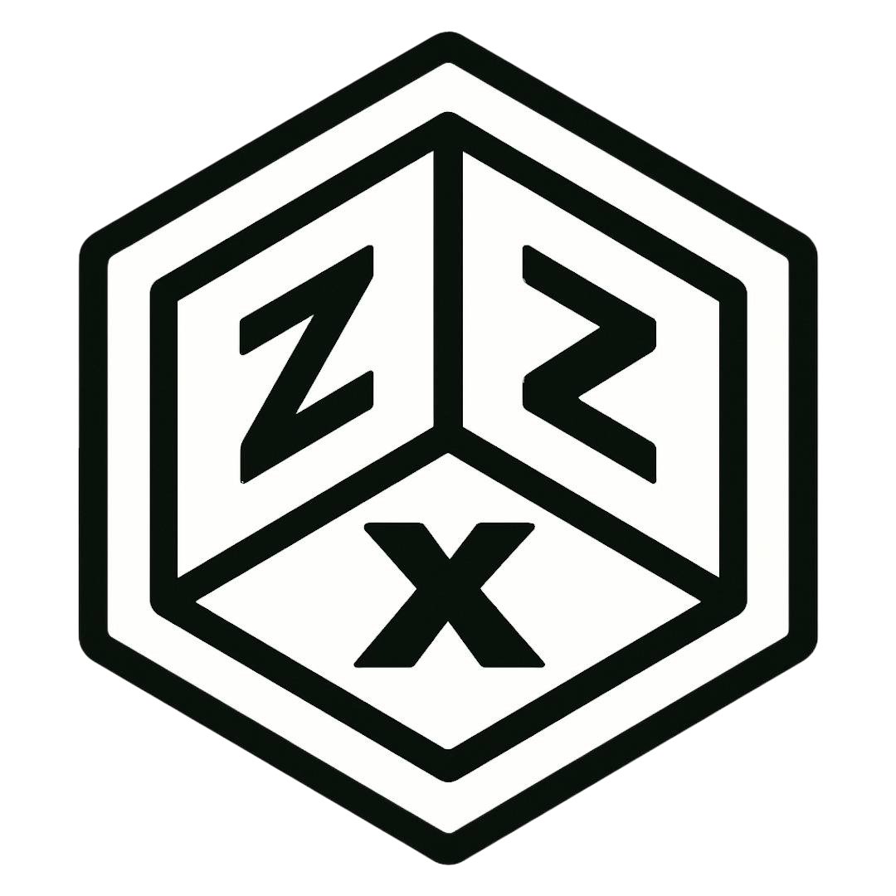

<div align="center">


# Projects

The canonical cross-area project index for ZZX-Labs R&D.

**Version:** 0.2.0-dev  
**Master project identities:** 420  
**Software-route identities:** 388  
**Portfolio areas:** 16  
**License:** MIT for this collection README; individual projects may use project-specific licenses  
**Author:** [0xdeadbeef] of ZZX-Labs R&D  
**Primary runtime:** Python 3.x with project-specific C, C++, Go, Rust, JavaScript, HTML/CSS, Kotlin/Android, firmware, and embedded runtimes

</div>

## What it does

`projects/` is the top-level project catalog and navigation root for ZZX-Labs R&D. It provides one place to:

- enumerate project identities across software, hardware, firmware, web, Bitcoin, cybersecurity, AI/ML, OSINT, mapping, media, research, engineering, data, applications, and related areas;
- resolve canonical titles, slugs, versions, statuses, and project routes;
- distinguish the master portfolio registry from deployable software routes;
- navigate into category-specific project indexes;
- preserve one consistent project-page shell across the website;
- keep human-readable project documentation aligned with machine-readable manifests;
- expose a stable root for website navigation, static mirrors, documentation, and project discovery.

The current reconciled master registry contains **420 unique project identities**. The software subcatalog contains **388 canonical software-route identities**.

## Install

The project index is part of the `zzx-labs-website` repository. No package manager is required to browse the static catalog.

```bash
git clone https://github.com/ZZX-Labs/zzx-labs-website.git
cd zzx-labs-website/projects
python -m http.server 8000
```

Then open:

```text
http://127.0.0.1:8000/
```

Individual child projects may require their own runtime, dependencies, native libraries, hardware, firmware toolchains, Bitcoin infrastructure, databases, or model files. Use each child project's own README and manifest as the authoritative runtime instructions.

## Run (GUI)

The `projects/` root is a browser catalog rather than a monolithic desktop application.

Open `index.html` through the website or a local HTTP server. Native GUI projects are launched from their own repositories/directories using the project-specific entrypoint documented by that project.

For Python GUI repositories that follow the ZZX-Labs entrypoint convention, the root GUI launcher is normally:

```text
<project>.py
```

## Run (CLI)

The root catalog has no single project-execution CLI.

CLI-capable repositories expose their own command-line entrypoint. For Python projects following the ZZX-Labs entrypoint convention, the standard root CLI launcher is:

```text
<project>-cli.py
```

The project manifests themselves can be validated with standard JSON tooling:

```bash
python -m json.tool manifest.json
```

## Math

Current portfolio invariants:

```text
master project identities     = 420
software-route identities     = 388
non-software-master identities= 32
portfolio classification areas= 16
unique master slugs           = 420
```

The master portfolio and software-route catalog are intentionally different layers. A hardware, web, research, or other portfolio identity may belong in the master registry without becoming a `/projects/software/` route.

### Project areas

| Area | Projects |
|---|---:|
| `cyber-security` | 82 |
| `bitcoin` | 75 |
| `software` | 55 |
| `media` | 49 |
| `web` | 28 |
| `ai` | 21 |
| `osint` | 17 |
| `apps` | 16 |
| `adult` | 15 |
| `hardware` | 15 |
| `engineering` | 13 |
| `data` | 11 |
| `research` | 9 |
| `ml` | 7 |
| `mapping` | 6 |
| `firmware` | 1 |

### Release/status distribution

| Status | Projects |
|---|---:|
| `alpha` | 343 |
| `development` | 33 |
| `stable` | 29 |
| `beta` | 8 |
| `superseded` | 3 |
| `prototype` | 2 |
| `planned` | 1 |
| `production` | 1 |

---

## Directory layout

The root project shell uses the same shared page contract as the rest of the site:

```text
projects/
├─ README.md
├─ LICENSE
├─ index.html
├─ manifest.json
├─ style.css
├─ script.js
├─ hook.js
├─ hook.css
├─ logo.png
├─ firmware/
│  ├─ README.md
│  ├─ index.html
│  ├─ manifest.json
│  ├─ style.css
│  ├─ script.js
│  ├─ hook.js
│  ├─ hook.css
│  └─ logo.png
├─ hardware/
│  ├─ bit-tick/
│  ├─ README.md
│  ├─ index.html
│  ├─ manifest.json
│  ├─ style.css
│  ├─ script.js
│  ├─ hook.js
│  ├─ hook.css
│  └─ logo.png
├─ software/
│  ├─ 4-4/
│  ├─ aipdabe/
│  ├─ ...
│  ├─ README.md
│  ├─ index.html
│  ├─ manifest.json
│  ├─ style.css
│  ├─ script.js
│  ├─ hook.js
│  ├─ hook.css
│  └─ logo.png
└─ web/
   ├─ bit-tick/
   ├─ isan/
   ├─ isrn/
   ├─ istv/
   ├─ isvn/
   ├─ zzx-labs.io/
   ├─ 0xdeadbeef.in/
   ├─ 0xdeadbeefconsulting.io/
   ├─ bit-tech.in/
   ├─ bit-tick.in/
   ├─ speciedex.org/
   ├─ cyberarmsbazaar.io/
   ├─ README.md
   ├─ index.html
   ├─ manifest.json
   ├─ style.css
   ├─ script.js
   ├─ hook.js
   ├─ hook.css
   └─ logo.png
```

The tree above documents the currently established root/category structure from this project index. The master portfolio classification is broader than these four physical subcatalog roots; classification metadata and filesystem deployment should not be treated as identical concepts.

Every category root should preserve the common shell where applicable:

```text
README.md
LICENSE
index.html
manifest.json
style.css
script.js
hook.js
hook.css
logo.png
```

Project-specific source, assets, documentation, data, models, firmware, hardware files, and native entrypoints live below the appropriate project root.

## Manifest model

The root `manifest.json` should serve as the machine-readable project index used by the website.

At minimum, each project identity should resolve:

```text
slug
title
canonical route
version
status
category / home category
summary
platforms
parent / suite relationship where applicable
aliases / supersession metadata where applicable
```

A manifest entry should never be silently duplicated simply because the same project appears in more than one research domain. Cross-domain classification belongs in metadata; project identity remains canonical.

## Portfolio versus deployed routes

The project system separates three related concepts:

1. **Identity** — the canonical project record in the master portfolio.
2. **Classification** — the project's home area and any secondary research domains.
3. **Deployment route** — the actual project path rendered by the website.

This distinction prevents one project from becoming multiple fake projects merely because it is relevant to Bitcoin, cybersecurity, AI, media, hardware, or another discipline at the same time.

## Navigation quickstart

**0–9 / Symbols** — [`0xdeadbeef.in`](./web/0xdeadbeef.in/) · [`0xdeadbeefconsulting.io`](./web/0xdeadbeefconsulting.io/) · [`4-4`](./software/4-4/) · [`4-4-apk`](./apps/4-4-apk/) · [`4dv`](./media/4dv/)
**A** — [`adrenochrome`](./cyber-security/adrenochrome/) · [`aegissim`](./engineering/aegissim/) · [`ahab`](./bitcoin/ahab/) · [`aipdabe`](./bitcoin/aipdabe/) · [`air2w3w`](./osint/air2w3w/) · [`alexberossusgpt`](./ai/alexberossusgpt/) · [`ambergris`](./cyber-security/ambergris/) · [`amurtiger`](./cyber-security/amurtiger/) · [`androidpp`](./apps/androidpp/) · [`arabianleopard`](./cyber-security/arabianleopard/) · [`archivetagger`](./ai/archivetagger/) · [`astral-clock`](./research/astral-clock/) · [`audio-tagger`](./media/audio-tagger/) · [`audiolab`](./cyber-security/audiolab/) · [`audiosieve`](./media/audiosieve/)
**B** — [`backabit`](./bitcoin/backabit/) · [`backinabit`](./bitcoin/backinabit/) · [`backnabit`](./bitcoin/backnabit/) · [`balaklavabuilder3d`](./mapping/balaklavabuilder3d/) · [`base48-bdef`](./bitcoin/base48-bdef/) · [`bealeforce`](./cyber-security/bealeforce/) · [`beefs-diceware-wordlists`](./cyber-security/beefs-diceware-wordlists/) · [`beefs-rngs`](./cyber-security/beefs-rngs/) · [`beetlee`](./research/beetlee/) · [`behaviorscope`](./cyber-security/behaviorscope/) · [`berossus`](./ai/berossus/) · [`berossusvoiceai`](./ml/berossusvoiceai/) · [`bhopal-calc`](./software/bhopal-calc/) · [`bit-clock`](./bitcoin/bit-clock/) · [`bit-monitor`](./bitcoin/bit-monitor/) · [`bit-tech.in`](./web/bit-tech.in/) · [`bit-tick`](./web/bit-tick/) · [`bit-tick-m5-os`](./hardware/bit-tick-m5-os/) · [`bit-tick-wio-os`](./hardware/bit-tick-wio-os/) · [`bit-tick.in`](./web/bit-tick.in/) · [`bit-tracker`](./bitcoin/bit-tracker/) · [`bitage`](./bitcoin/bitage/) · [`bitarmor`](./bitcoin/bitarmor/) · [`bitavg`](./bitcoin/bitavg/) · [`bitbetting`](./bitcoin/bitbetting/) · [`bitbilling`](./bitcoin/bitbilling/) · [`bitbroker`](./bitcoin/bitbroker/) · [`bitburn`](./bitcoin/bitburn/) · [`bitcasino`](./bitcoin/bitcasino/) · [`bitcoin-mined`](./bitcoin/bitcoin-mined/) · [`bitcoin-tully`](./bitcoin/bitcoin-tully/) · [`bitcoinees`](./bitcoin/bitcoinees/) · [`bitcoinscope`](./bitcoin/bitcoinscope/) · [`bitcontract`](./bitcoin/bitcontract/) · [`bitcontractor`](./bitcoin/bitcontractor/) · [`bitdroid`](./bitcoin/bitdroid/) · [`bitescrow`](./bitcoin/bitescrow/) · [`bitfig`](./bitcoin/bitfig/) · [`bitgaming`](./bitcoin/bitgaming/) · [`bitjack`](./bitcoin/bitjack/) · [`bitlegal`](./bitcoin/bitlegal/) · [`bitlotto`](./bitcoin/bitlotto/) · [`bitonion`](./bitcoin/bitonion/) · [`bitpav`](./bitcoin/bitpav/) · [`bitpet`](./bitcoin/bitpet/) · [`bitrng`](./bitcoin/bitrng/) · [`bittrackit`](./bitcoin/bittrackit/) · [`bittrader`](./bitcoin/bittrader/) · [`blackbat`](./bitcoin/blackbat/) · [`blackbook`](./adult/blackbook/) · [`blackpearl`](./adult/blackpearl/) · [`blekrat`](./software/blekrat/) · [`blinkeeqr`](./mapping/blinkeeqr/) · [`blk2txt`](./bitcoin/blk2txt/) · [`blockclock`](./bitcoin/blockclock/) · [`blockclock-apk`](./bitcoin/blockclock-apk/) · [`blockclock-device`](./hardware/blockclock-device/) · [`bofs`](./data/bofs/) · [`borq`](./media/borq/) · [`bvtp`](./media/bvtp/)
**C** — [`calsched`](./software/calsched/) · [`cannadex`](./cyber-security/cannadex/) · [`cannapedia`](./cyber-security/cannapedia/) · [`carter`](./ai/carter/) · [`casbra`](./ai/casbra/) · [`cdrc`](./data/cdrc/) · [`cees-chirp`](./media/cees-chirp/) · [`cgai`](./adult/cgai/) · [`chappievc`](./engineering/robotics/chappievc/) · [`character-generator`](./software/character-generator/) · [`character-rng`](./ml/character-rng/) · [`coreshim`](./bitcoin/coreshim/) · [`costanza-wallet`](./hardware/costanza-wallet/) · [`courtlistener-ac`](./media/courtlistener-ac/) · [`cryptainer`](./bitcoin/cryptainer/) · [`cryptainer-device`](./hardware/cryptainer-device/) · [`cyberarmsbazaar.io`](./web/cyberarmsbazaar.io/) · [`cyberchefapk`](./cyber-security/cyberchefapk/) · [`cyberchefapk-offline`](./cyber-security/cyberchefapk-offline/) · [`cyberchefapk-online`](./cyber-security/cyberchefapk-online/) · [`cyberchefapk-server`](./cyber-security/cyberchefapk-server/) · [`cyberchefbash`](./software/cyberchefbash/) · [`cyberchefbat`](./software/cyberchefbat/) · [`cyberchefc`](./cyber-security/cyberchefc/) · [`cyberchefcpp`](./cyber-security/cyberchefcpp/) · [`cyberchefcsharp`](./cyber-security/cyberchefcsharp/) · [`cyberchefcss`](./web/cyberchefcss/) · [`cyberchefcy`](./cyber-security/cyberchefcy/) · [`cyberchefgo`](./software/cyberchefgo/) · [`cyberchefhtml`](./web/cyberchefhtml/) · [`cyberchefjava`](./apps/cyberchefjava/) · [`cyberchefjs`](./web/cyberchefjs/) · [`cyberchefkit`](./cyber-security/cyberchefkit/) · [`cyberchefkt`](./apps/cyberchefkt/) · [`cybercheflua`](./software/cybercheflua/) · [`cyberchefmpy`](./firmware/cyberchefmpy/) · [`cyberchefperl`](./cyber-security/cyberchefperl/) · [`cyberchefphp`](./web/cyberchefphp/) · [`cyberchefps`](./software/cyberchefps/) · [`cyberchefpy`](./cyber-security/cyberchefpy/) · [`cyberchefr`](./cyber-security/cyberchefr/) · [`cyberchefruby`](./cyber-security/cyberchefruby/) · [`cyberchefrust`](./software/cyberchefrust/) · [`cyberchefswift`](./apps/cyberchefswift/) · [`cyberchefts`](./web/cyberchefts/) · [`cyberconcubine`](./adult/cyberconcubine/)
**D** — [`dabtimer`](./software/dabtimer/) · [`dabtimer-apk`](./apps/dabtimer-apk/) · [`datascope`](./data/datascope/) · [`davinci`](./ai/davinci/) · [`ddt`](./cyber-security/ddt/) · [`deadbeefid`](./cyber-security/deadbeefid/) · [`devicescope`](./osint/devicescope/) · [`dhama`](./media/dhama/) · [`dharma-lab`](./cyber-security/dharma-lab/) · [`dicelocks`](./cyber-security/dicelocks/) · [`discord-downgrader`](./media/discord-downgrader/) · [`domainscope`](./osint/domainscope/) · [`droed-systems`](./engineering/robotics/droed-systems/) · [`droid-systems`](./engineering/robotics/droid-systems/) · [`drones`](./engineering/drones/drones/)
**E** — [`emailscope`](./cyber-security/emailscope/) · [`emigna`](./cyber-security/emigna/) · [`expanded-diceware-volumes`](./cyber-security/expanded-diceware-volumes/) · [`eyebreaker`](./software/eyebreaker/) · [`eyebreaker-apk`](./apps/eyebreaker-apk/)
**F** — [`far`](./media/far/) · [`fartinajar`](./cyber-security/fartinajar/) · [`fcpc`](./cyber-security/fcpc/) · [`fieldrecorder`](./cyber-security/fieldrecorder/) · [`fieldrecorder-apk`](./cyber-security/fieldrecorder-apk/) · [`fivetrace`](./osint/fivetrace/) · [`flyr`](./cyber-security/flyr/) · [`freedomgewse`](./bitcoin/freedomgewse/) · [`freedomgewsecex`](./bitcoin/freedomgewsecex/) · [`freedomgewsedex`](./bitcoin/freedomgewsedex/) · [`freedomkobra`](./bitcoin/freedomkobra/) · [`freedomkobracex`](./bitcoin/freedomkobracex/) · [`freedomkobradex`](./bitcoin/freedomkobradex/) · [`freedomx`](./bitcoin/freedomx/) · [`fullnode-scraper`](./bitcoin/fullnode-scraper/)
**G** — [`gameo`](./research/gameo/) · [`gardenharvester`](./media/gardenharvester/) · [`gbb`](./adult/gbb/) · [`geoadd`](./mapping/geoadd/) · [`geoscope`](./osint/geoscope/) · [`ggai`](./adult/ggai/) · [`gks`](./bitcoin/gks/) · [`gnee`](./bitcoin/gnee/) · [`gomle`](./media/gomle/) · [`gp`](./adult/gp/) · [`gpai`](./ai/gpai/) · [`gpgai`](./ai/gpgai/) · [`greywave`](./media/greywave/) · [`gridhub`](./web/gridhub/) · [`gsk`](./software/gsk/) · [`gutorcal`](./software/gutorcal/) · [`gwalr`](./osint/gwalr/) · [`gwen`](./osint/gwen/)
**H** — [`hasher`](./cyber-security/hasher/) · [`hashpig`](./bitcoin/hashpig/) · [`huah`](./cyber-security/huah/) · [`hydrame`](./cyber-security/hydrame/) · [`hydrameapk`](./apps/hydrameapk/)
**I** — [`iching`](./bitcoin/iching/) · [`identityscope`](./cyber-security/identityscope/) · [`imaghee`](./media/imaghee/) · [`ipscope`](./cyber-security/ipscope/) · [`isan`](./web/isan/) · [`isn`](./web/isn/) · [`isrn`](./web/isrn/) · [`istv`](./web/istv/) · [`isvn`](./web/isvn/)
**K** — [`kermits-trident`](./cyber-security/kermits-trident/) · [`keykey`](./data/keykey/) · [`kinkiju`](./adult/kinkiju/) · [`kinkiju-apk`](./apps/kinkiju-apk/) · [`kinkr`](./adult/kinkr/) · [`kyky`](./osint/kyky/)
**L** — [`lexiphor`](./web/lexiphor/) · [`lightninglotto`](./bitcoin/lightninglotto/) · [`linemanmoon`](./hardware/linemanmoon/) · [`linkscope`](./adult/linkscope/) · [`luminaobscura`](./media/luminaobscura/) · [`lunapy`](./software/lunapy/) · [`lunapycam`](./media/lunapycam/) · [`lunar-clock`](./software/lunar-clock/)
**M** — [`macscope`](./osint/macscope/) · [`magneta`](./cyber-security/magneta/) · [`maliplib`](./cyber-security/maliplib/) · [`manchuriantiger`](./cyber-security/manchuriantiger/) · [`mantrabox`](./media/mantrabox/) · [`markhorsheep`](./cyber-security/markhorsheep/) · [`marvis`](./ai/marvis/) · [`marvis-rngvg`](./ai/marvis-rngvg/) · [`md2pdf`](./software/md2pdf/) · [`memeantix`](./web/memeantix/) · [`memeantix-cwg`](./software/memeantix-cwg/) · [`memeantix-fso`](./software/memeantix-fso/) · [`memeantix-peg`](./software/memeantix-peg/) · [`memeantix-sdo`](./software/memeantix-sdo/) · [`mempoolspecs`](./bitcoin/mempoolspecs/) · [`merlin`](./ai/merlin/) · [`metatagdb`](./ai/metatagdb/) · [`mnemonic-generator`](./bitcoin/mnemonic-generator/) · [`mozlib`](./media/mozlib/) · [`mu3u`](./media/mu3u/)
**N** — [`nameprobe`](./cyber-security/nameprobe/) · [`naturava`](./ai/naturava/) · [`netscope`](./osint/netscope/) · [`neville`](./research/neville/) · [`nginxapk`](./mapping/nginxapk/) · [`nodepix`](./bitcoin/nodepix/) · [`npdquery`](./data/npdquery/) · [`nubianibex`](./cyber-security/nubianibex/) · [`nutrame`](./cyber-security/nutrame/) · [`nutrameapk`](./apps/nutrameapk/)
**O** — [`ob1wan`](./bitcoin/ob1wan/) · [`openterra-workstation`](./cyber-security/openterra-workstation/) · [`osci`](./cyber-security/osci/) · [`otto`](./media/otto/) · [`ownmap`](./osint/ownmap/) · [`ownmap-apk`](./mapping/ownmap-apk/)
**P** — [`parallel-explorer`](./ai/parallel-explorer/) · [`pce`](./data/pce/) · [`persianleopard`](./cyber-security/persianleopard/) · [`pictocrypt`](./cyber-security/pictocrypt/) · [`pixelpixie`](./media/pixelpixie/) · [`pixiegif`](./media/pixiegif/) · [`pixiepixel`](./media/pixiepixel/) · [`pixiesprite`](./media/pixiesprite/) · [`polyhedra`](./software/polyhedra/) · [`polyorbit`](./software/polyorbit/) · [`portraitgen`](./ml/portraitgen/) · [`primenumhexgenseq`](./research/primenumhexgenseq/) · [`prngbignum`](./cyber-security/prngbignum/) · [`project-mongoose`](./cyber-security/project-mongoose/) · [`projectops`](./software/projectops/) · [`proner`](./adult/proner/) · [`proneros`](./adult/proneros/) · [`prototag`](./media/prototag/) · [`pryatki`](./osint/pryatki/) · [`pttp`](./bitcoin/pttp/) · [`pwrp`](./media/pwrp/) · [`pymatrix`](./software/pymatrix/) · [`pyos`](./apps/pyos/) · [`pytimecard`](./cyber-security/pytimecard/) · [`pytimecard-apk`](./apps/pytimecard-apk/)
**Q** — [`qtard`](./software/qtard/)
**R** — [`railguru`](./cyber-security/railguru/) · [`ramanujan`](./ai/ramanujan/) · [`randpassgeneratorkit`](./cyber-security/randpassgeneratorkit/) · [`randwiki`](./software/randwiki/) · [`rcalc`](./software/rcalc/) · [`realintel`](./cyber-security/realintel/) · [`redlist`](./cyber-security/redlist/) · [`redpanda`](./cyber-security/redpanda/) · [`resrou`](./software/resrou/) · [`rgbrng`](./software/rgbrng/) · [`robotics-systems`](./engineering/robotics/robotics-systems/) · [`rosebud`](./cyber-security/rosebud/) · [`rosebud-apk`](./apps/rosebud-apk/) · [`rov-systems`](./engineering/rovs/rov-systems/)
**S** — [`s7sentinel`](./ai/s7sentinel/) · [`safai_karta`](./media/safai_karta/) · [`saptacrypt`](./cyber-security/saptacrypt/) · [`scopez`](./bitcoin/scopez/) · [`scuzzlebutt`](./cyber-security/scuzzlebutt/) · [`sd-gui`](./ml/sd-gui/) · [`shairi_badalna`](./media/shairi_badalna/) · [`shaka-kahn`](./ml/shaka-kahn/) · [`signalscope`](./data/signalscope/) · [`skybee`](./engineering/skybee/) · [`skywasp`](./engineering/skywasp/) · [`soiva`](./ml/soiva/) · [`sparrownet`](./osint/sparrownet/) · [`speciedex`](./web/speciedex/) · [`speciedex.org`](./web/speciedex.org/) · [`speciedexapi`](./cyber-security/speciedexapi/) · [`speciedexapp`](./media/speciedexapp/) · [`speciedexarchives`](./media/speciedexarchives/) · [`speciedexcore`](./web/speciedexcore/) · [`speciedexexplorer`](./web/speciedexexplorer/) · [`speciedexgeneticbank`](./cyber-security/speciedexgeneticbank/) · [`speciedexnet`](./web/speciedexnet/) · [`speciedexterminal`](./cyber-security/speciedexterminal/) · [`speciedexweb`](./mapping/speciedexweb/) · [`spp`](./bitcoin/spp/) · [`sputnik`](./software/sputnik/) · [`starindb`](./software/starindb/) · [`stegomicrodot`](./cyber-security/stegomicrodot/) · [`stephenizer`](./ai/stephenizer/) · [`stirng`](./research/stirng/) · [`stoa`](./bitcoin/stoa/) · [`strainstringdb`](./data/strainstringdb/) · [`stubler`](./software/stubler/) · [`subcircus`](./bitcoin/subcircus/) · [`supercleaner`](./software/supercleaner/) · [`synthlavarng`](./cyber-security/synthlavarng/)
**T** — [`t4np`](./cyber-security/t4np/) · [`taktychna-mapa`](./cyber-security/taktychna-mapa/) · [`telecomscope`](./osint/telecomscope/) · [`tervis`](./ml/tervis/) · [`tervis-rngvg`](./ai/tervis-rngvg/) · [`thumbzilla`](./media/thumbzilla/) · [`tibetsgate`](./cyber-security/tibetsgate/) · [`timescope`](./osint/timescope/) · [`tldr`](./software/tldr/) · [`trackertally`](./cyber-security/trackertally/) · [`trackertally-apk`](./apps/trackertally-apk/) · [`tracy`](./osint/tracy/) · [`tripforge`](./cyber-security/tripforge/) · [`trustfun`](./bitcoin/trustfun/) · [`tycho`](./media/tycho/)
**U** — [`uavs`](./engineering/uavs/uavs/) · [`ugvs`](./engineering/ugvs/ugvs/) · [`umvs`](./engineering/umvs/umvs/) · [`urlscraper-firefox-browser-addon`](./web/urlscraper-firefox-browser-addon/) · [`userscope`](./osint/userscope/) · [`uuidgen`](./software/uuidgen/)
**V** — [`videosort`](./media/videosort/) · [`vidghee`](./media/vidghee/) · [`vidtag`](./media/vidtag/) · [`vidunisui`](./media/vidunisui/) · [`vikram`](./software/vikram/) · [`vishal`](./media/vishal/) · [`vishnu`](./media/vishnu/) · [`vlc-alarmclock`](./media/vlc-alarmclock/) · [`vlc-box`](./hardware/vlc-box/) · [`vlc-ticker`](./media/vlc-ticker/) · [`vlc2discordstatus`](./media/vlc2discordstatus/) · [`vmc`](./hardware/vmc/) · [`vmc-arduino-micro`](./hardware/vmc-arduino-micro/) · [`vmc-arduino-mini`](./hardware/vmc-arduino-mini/) · [`vmc-arduino-nano`](./hardware/vmc-arduino-nano/) · [`vmc-arduino-uno-r4`](./hardware/vmc-arduino-uno-r4/) · [`vmc-device`](./hardware/vmc-device/) · [`vmc-esp32`](./hardware/vmc-esp32/) · [`vmf`](./media/vmf/) · [`voise`](./media/voise/) · [`vqr`](./software/vqr/) · [`vvardriving`](./software/vvardriving/)
**W** — [`wally`](./engineering/wally/) · [`warpdrive`](./media/warpdrive/) · [`wendelizer`](./media/wendelizer/) · [`westafricanlion`](./cyber-security/westafricanlion/) · [`wikispeciescore`](./data/wikispeciescore/) · [`wiper`](./cyber-security/wiper/) · [`wirefeed`](./research/wirefeed/) · [`woclock`](./software/woclock/) · [`woise`](./media/woise/) · [`wordharvest`](./software/wordharvest/) · [`wordsofsatoshi`](./bitcoin/wordsofsatoshi/) · [`wyty`](./software/wyty/)
**X** — [`xconstats`](./software/xconstats/)
**Y** — [`ytrp`](./media/ytrp/)
**Z** — [`z64`](./cyber-security/z64/) · [`zerox`](./software/zerox/) · [`zira`](./ai/zira/) · [`zmatrix`](./software/zmatrix/) · [`zorean-3d6-plus`](./adult/zorean-3d6-plus/) · [`zorean-ritual-altar`](./adult/zorean-ritual-altar/) · [`zorean-tablet-studio`](./software/zorean-tablet-studio/) · [`zoreforge`](./research/zoreforge/) · [`zzx-bcf`](./software/zzx-bcf/) · [`zzx-bitcoin-ticker`](./bitcoin/zzx-bitcoin-ticker/) · [`zzx-github-stats`](./cyber-security/zzx-github-stats/) · [`zzx-labs.com`](./web/zzx-labs.com/) · [`zzx-labs.io`](./web/zzx-labs.io/) · [`zzx-live-gif-widget`](./bitcoin/zzx-live-gif-widget/) · [`zzx-mempool-visualizer`](./bitcoin/zzx-mempool-visualizer/) · [`zzx-pass`](./cyber-security/zzx-pass/) · [`zzx-worldfactbook`](./data/zzx-worldfactbook/) · [`zzx0gp`](./software/zzx0gp/) · [`zzxasb`](./media/zzxasb/) · [`zzxbbc`](./hardware/zzxbbc/) · [`zzxbcs`](./software/zzxbcs/) · [`zzxbitnodes`](./bitcoin/zzxbitnodes/) · [`zzxbitnodes-maphost`](./bitcoin/zzxbitnodes-maphost/) · [`zzxblogpost`](./research/zzxblogpost/) · [`zzxblogpost-apk`](./apps/zzxblogpost-apk/) · [`zzxcex`](./bitcoin/zzxcex/) · [`zzxcore`](./software/zzxcore/) · [`zzxdes`](./web/zzxdes/) · [`zzxdex`](./bitcoin/zzxdex/) · [`zzxffk`](./cyber-security/zzxffk/) · [`zzxgcs`](./software/zzxgcs/) · [`zzxkld`](./cyber-security/zzxkld/) · [`zzxloss-bb`](./software/zzxloss-bb/) · [`zzxmsp`](./bitcoin/zzxmsp/) · [`zzxosc`](./cyber-security/zzxosc/) · [`zzxpp`](./apps/zzxpp/) · [`zzxsbs`](./software/zzxsbs/) · [`zzxsss`](./data/zzxsss/) · [`zzxsst`](./software/zzxsst/) · [`zzxstt`](./ai/zzxstt/) · [`zzxtas`](./bitcoin/zzxtas/) · [`zzxtts`](./ai/zzxtts/) · [`zzxvcs`](./media/zzxvcs/) · [`zzxvss`](./adult/zzxvss/)

---

## Complete cross-area project index

The tables below are generated from the reconciled **420-identity master portfolio manifest**.

### Adult (15)

| # | Project | Slug | Version | Status | Canonical route |
|---:|---|---|---|---|---|
| 001 | [BlackBook](./adult/blackbook/) | `blackbook` | `0.1.0-alpha` | `alpha` | `/projects/adult/blackbook/` |
| 002 | [BlackPearl](./adult/blackpearl/) | `blackpearl` | `0.1.0-alpha` | `alpha` | `/projects/adult/blackpearl/` |
| 003 | [CyberConcubine](./adult/cyberconcubine/) | `cyberconcubine` | `0.1.0-alpha` | `alpha` | `/projects/adult/cyberconcubine/` |
| 004 | [CyberGeisha-AI (Adult-NSFW)](./adult/cgai/) | `cgai` | `0.1.0-alpha` | `alpha` | `/projects/adult/cgai/` |
| 005 | [GeishaGallery-AI (Adult-NSFW)](./adult/ggai/) | `ggai` | `0.1.0-alpha` | `alpha` | `/projects/adult/ggai/` |
| 006 | [Geisha’s BlackBook](./adult/gbb/) | `gbb` | `0.1.0-alpha` | `alpha` | `/projects/adult/gbb/` |
| 007 | [GP: (GPT PDA)](./adult/gp/) | `gp` | `0.2.0-alpha` | `alpha` | `/projects/adult/gp/` |
| 008 | [Kinkiju](./adult/kinkiju/) | `kinkiju` | `0.1.0-alpha` | `alpha` | `/projects/adult/kinkiju/` |
| 009 | [kinkr](./adult/kinkr/) | `kinkr` | `0.1.0-alpha` | `alpha` | `/projects/adult/kinkr/` |
| 010 | [LinkScope](./adult/linkscope/) | `linkscope` | `0.1.0-alpha` | `alpha` | `/projects/adult/linkscope/` |
| 011 | [PRONER](./adult/proner/) | `proner` | `0.1.0-alpha` | `alpha` | `/projects/adult/proner/` |
| 012 | [PRONER-OS](./adult/proneros/) | `proneros` | `0.1.0-alpha` | `alpha` | `/projects/adult/proneros/` |
| 013 | [Zorean 3d6+](./adult/zorean-3d6-plus/) | `zorean-3d6-plus` | `1.0.0` | `alpha` | `/projects/adult/zorean-3d6-plus/` |
| 014 | [Zorean Ritual Altar](./adult/zorean-ritual-altar/) | `zorean-ritual-altar` | `0.1.0-alpha` | `planned` | `/projects/adult/zorean-ritual-altar/` |
| 015 | [ZZX-VSS](./adult/zzxvss/) | `zzxvss` | `0.1.0-alpha` | `alpha` | `/projects/adult/zzxvss/` |

### Ai (21)

| # | Project | Slug | Version | Status | Canonical route |
|---:|---|---|---|---|---|
| 001 | [AlexBerossusGPT](./ai/alexberossusgpt/) | `alexberossusgpt` | `0.1.0-alpha` | `alpha` | `/projects/ai/alexberossusgpt/` |
| 002 | [ArchiveTagger](./ai/archivetagger/) | `archivetagger` | `0.1.0-alpha` | `alpha` | `/projects/ai/archivetagger/` |
| 003 | [Berossus](./ai/berossus/) | `berossus` | `0.3.0-beta` | `beta` | `/projects/ai/berossus/` |
| 004 | [Carter (CCTV Streaming System)](./ai/carter/) | `carter` | `0.1.0-alpha` | `alpha` | `/projects/ai/carter/` |
| 005 | [CasBra](./ai/casbra/) | `casbra` | `0.1.0-alpha` | `alpha` | `/projects/ai/casbra/` |
| 006 | [DaVinci](./ai/davinci/) | `davinci` | `1.0.1` | `alpha` | `/projects/ai/davinci/` |
| 007 | [GP-AI](./ai/gpai/) | `gpai` | `0.2.0-alpha` | `alpha` | `/projects/ai/gpai/` |
| 008 | [GP-Gallery-AI](./ai/gpgai/) | `gpgai` | `0.2.0-alpha` | `alpha` | `/projects/ai/gpgai/` |
| 009 | [MarVIS](./ai/marvis/) | `marvis` | `0.3.0-alpha` | `alpha` | `/projects/ai/marvis/` |
| 010 | [MarVIS-RNGvG](./ai/marvis-rngvg/) | `marvis-rngvg` | `0.2.0-alpha` | `alpha` | `/projects/ai/marvis-rngvg/` |
| 011 | [Merlin](./ai/merlin/) | `merlin` | `TBD` | `development` | `/projects/ai/merlin/` |
| 012 | [MetaTagDB](./ai/metatagdb/) | `metatagdb` | `0.4.0-alpha` | `alpha` | `/projects/ai/metatagdb/` |
| 013 | [NaturaVA](./ai/naturava/) | `naturava` | `0.2.0-alpha` | `alpha` | `/projects/ai/naturava/` |
| 014 | [Parallel Explorer](./ai/parallel-explorer/) | `parallel-explorer` | `0.3.0-alpha` | `alpha` | `/projects/ai/parallel-explorer/` |
| 015 | [Ramanujan](./ai/ramanujan/) | `ramanujan` | `0.3.0-alpha` | `alpha` | `/projects/ai/ramanujan/` |
| 016 | [S7Sentinel](./ai/s7sentinel/) | `s7sentinel` | `0.3.0` | `stable` | `/projects/ai/s7sentinel/` |
| 017 | [Stephenizer](./ai/stephenizer/) | `stephenizer` | `0.1.0-alpha` | `alpha` | `/projects/ai/stephenizer/` |
| 018 | [TerVIS-RNGvG](./ai/tervis-rngvg/) | `tervis-rngvg` | `0.2.0-alpha` | `alpha` | `/projects/ai/tervis-rngvg/` |
| 019 | [ZIRA](./ai/zira/) | `zira` | `0.4.0-alpha` | `alpha` | `/projects/ai/zira/` |
| 020 | [ZZX-STT](./ai/zzxstt/) | `zzxstt` | `0.1.0-alpha` | `alpha` | `/projects/ai/zzxstt/` |
| 021 | [ZZX-TTS](./ai/zzxtts/) | `zzxtts` | `0.1.0-alpha` | `alpha` | `/projects/ai/zzxtts/` |

### Apps (16)

| # | Project | Slug | Version | Status | Canonical route |
|---:|---|---|---|---|---|
| 001 | [4⁴ Breath (APK)](./apps/4-4-apk/) | `4-4-apk` | `1.0.0` | `stable` | `/projects/apps/4-4-apk/` |
| 002 | [Android++](./apps/androidpp/) | `androidpp` | `0.6.0-alpha` | `alpha` | `/projects/apps/androidpp/` |
| 003 | [CyberChefJava](./apps/cyberchefjava/) | `cyberchefjava` | `0.1.0-alpha` | `alpha` | `/projects/apps/cyberchefjava/` |
| 004 | [CyberChefKotlin](./apps/cyberchefkt/) | `cyberchefkt` | `0.1.0-alpha` | `alpha` | `/projects/apps/cyberchefkt/` |
| 005 | [CyberChefSwift](./apps/cyberchefswift/) | `cyberchefswift` | `0.1.0-alpha` | `alpha` | `/projects/apps/cyberchefswift/` |
| 006 | [Dab Timer (APK)](./apps/dabtimer-apk/) | `dabtimer-apk` | `0.1.0-alpha` | `alpha` | `/projects/apps/dabtimer-apk/` |
| 007 | [EyeBreaker (APK)](./apps/eyebreaker-apk/) | `eyebreaker-apk` | `1.0.0` | `stable` | `/projects/apps/eyebreaker-apk/` |
| 008 | [HydraMeAPK](./apps/hydrameapk/) | `hydrameapk` | `0.1.0-alpha` | `alpha` | `/projects/apps/hydrameapk/` |
| 009 | [Kinkiju (APK)](./apps/kinkiju-apk/) | `kinkiju-apk` | `0.1.0-alpha` | `alpha` | `/projects/apps/kinkiju-apk/` |
| 010 | [NutraMeAPK](./apps/nutrameapk/) | `nutrameapk` | `0.1.0-alpha` | `alpha` | `/projects/apps/nutrameapk/` |
| 011 | [PyOS](./apps/pyos/) | `pyos` | `0.2.0-alpha` | `alpha` | `/projects/apps/pyos/` |
| 012 | [PyTimecard (APK)](./apps/pytimecard-apk/) | `pytimecard-apk` | `0.9.0-beta` | `beta` | `/projects/apps/pytimecard-apk/` |
| 013 | [RoseBud (APK)](./apps/rosebud-apk/) | `rosebud-apk` | `0.1.0-alpha` | `alpha` | `/projects/apps/rosebud-apk/` |
| 014 | [TrackerTally (APK)](./apps/trackertally-apk/) | `trackertally-apk` | `1.0.0` | `stable` | `/projects/apps/trackertally-apk/` |
| 015 | [ZZX++](./apps/zzxpp/) | `zzxpp` | `0.6.0-alpha` | `alpha` | `/projects/apps/zzxpp/` |
| 016 | [zzxblogpost (APK)](./apps/zzxblogpost-apk/) | `zzxblogpost-apk` | `1.0.0` | `stable` | `/projects/apps/zzxblogpost-apk/` |

### Bitcoin (75)

| # | Project | Slug | Version | Status | Canonical route |
|---:|---|---|---|---|---|
| 001 | [Ahab](./bitcoin/ahab/) | `ahab` | `1.1.0` | `alpha` | `/projects/bitcoin/ahab/` |
| 002 | [AIPDABE (AI Personal Digital Assistant for Bitcoin Exploration)](./bitcoin/aipdabe/) | `aipdabe` | `0.1.0-alpha` | `alpha` | `/projects/bitcoin/aipdabe/` |
| 003 | [BackABit](./bitcoin/backabit/) | `backabit` | `0.1.0-alpha` | `alpha` | `/projects/bitcoin/backabit/` |
| 004 | [BackInABit](./bitcoin/backinabit/) | `backinabit` | `0.1.0-alpha` | `alpha` | `/projects/bitcoin/backinabit/` |
| 005 | [BackNABit](./bitcoin/backnabit/) | `backnabit` | `0.1.0-alpha` | `alpha` | `/projects/bitcoin/backnabit/` |
| 006 | [Base48 (NoCSPAM) / BDEF](./bitcoin/base48-bdef/) | `base48-bdef` | `1.0.0` | `stable` | `/projects/bitcoin/base48-bdef/` |
| 007 | [Bit-Clock](./bitcoin/bit-clock/) | `bit-clock` | `0.1.0-alpha` | `alpha` | `/projects/bitcoin/bit-clock/` |
| 008 | [Bit-Monitor](./bitcoin/bit-monitor/) | `bit-monitor` | `0.1.0-alpha` | `alpha` | `/projects/bitcoin/bit-monitor/` |
| 009 | [Bit-Tracker](./bitcoin/bit-tracker/) | `bit-tracker` | `0.1.0-alpha` | `alpha` | `/projects/bitcoin/bit-tracker/` |
| 010 | [BitAge](./bitcoin/bitage/) | `bitage` | `0.2.0-alpha` | `alpha` | `/projects/bitcoin/bitage/` |
| 011 | [BitArmor](./bitcoin/bitarmor/) | `bitarmor` | `0.1.0-alpha` | `alpha` | `/projects/bitcoin/bitarmor/` |
| 012 | [BitAvg](./bitcoin/bitavg/) | `bitavg` | `0.2.0-beta` | `beta` | `/projects/bitcoin/bitavg/` |
| 013 | [BitBetting](./bitcoin/bitbetting/) | `bitbetting` | `0.1.0-alpha` | `alpha` | `/projects/bitcoin/bitbetting/` |
| 014 | [BitBilling](./bitcoin/bitbilling/) | `bitbilling` | `0.9.0-beta` | `beta` | `/projects/bitcoin/bitbilling/` |
| 015 | [BitBroker](./bitcoin/bitbroker/) | `bitbroker` | `0.2.0-beta` | `beta` | `/projects/bitcoin/bitbroker/` |
| 016 | [BitBurn](./bitcoin/bitburn/) | `bitburn` | `0.1.0-alpha` | `alpha` | `/projects/bitcoin/bitburn/` |
| 017 | [BitCasino](./bitcoin/bitcasino/) | `bitcasino` | `0.1.0-alpha` | `alpha` | `/projects/bitcoin/bitcasino/` |
| 018 | [Bitcoin EMIGNA Encoding System (BEES)](./bitcoin/bitcoinees/) | `bitcoinees` | `0.1.0-alpha` | `alpha` | `/projects/bitcoin/bitcoinees/` |
| 019 | [Bitcoin-Mined](./bitcoin/bitcoin-mined/) | `bitcoin-mined` | `0.1.0-alpha` | `alpha` | `/projects/bitcoin/bitcoin-mined/` |
| 020 | [Bitcoin-Tully](./bitcoin/bitcoin-tully/) | `bitcoin-tully` | `0.1.0-alpha` | `alpha` | `/projects/bitcoin/bitcoin-tully/` |
| 021 | [BitcoinScope](./bitcoin/bitcoinscope/) | `bitcoinscope` | `0.1.0-alpha` | `alpha` | `/projects/bitcoin/bitcoinscope/` |
| 022 | [BitContract](./bitcoin/bitcontract/) | `bitcontract` | `0.1.0-alpha` | `alpha` | `/projects/bitcoin/bitcontract/` |
| 023 | [BitContractor](./bitcoin/bitcontractor/) | `bitcontractor` | `0.1.0-alpha` | `alpha` | `/projects/bitcoin/bitcontractor/` |
| 024 | [BitDroid](./bitcoin/bitdroid/) | `bitdroid` | `TBD` | `development` | `/projects/bitcoin/bitdroid/` |
| 025 | [BitEscrow](./bitcoin/bitescrow/) | `bitescrow` | `0.1.0-alpha` | `alpha` | `/projects/bitcoin/bitescrow/` |
| 026 | [BitFig](./bitcoin/bitfig/) | `bitfig` | `0.2.0-alpha` | `alpha` | `/projects/bitcoin/bitfig/` |
| 027 | [BitGaming](./bitcoin/bitgaming/) | `bitgaming` | `0.1.0-alpha` | `alpha` | `/projects/bitcoin/bitgaming/` |
| 028 | [BitJack](./bitcoin/bitjack/) | `bitjack` | `0.1.0-alpha` | `alpha` | `/projects/bitcoin/bitjack/` |
| 029 | [BitLegal](./bitcoin/bitlegal/) | `bitlegal` | `0.1.0-alpha` | `alpha` | `/projects/bitcoin/bitlegal/` |
| 030 | [BitLotto](./bitcoin/bitlotto/) | `bitlotto` | `0.3.0-alpha` | `alpha` | `/projects/bitcoin/bitlotto/` |
| 031 | [BitOnion](./bitcoin/bitonion/) | `bitonion` | `0.1.0-alpha` | `alpha` | `/projects/bitcoin/bitonion/` |
| 032 | [BitPav (Bitcoin Proof-of-Worth Tracker)](./bitcoin/bitpav/) | `bitpav` | `0.1.0-alpha` | `alpha` | `/projects/bitcoin/bitpav/` |
| 033 | [BitPet](./bitcoin/bitpet/) | `bitpet` | `0.1.0-alpha` | `alpha` | `/projects/bitcoin/bitpet/` |
| 034 | [BitRNG](./bitcoin/bitrng/) | `bitrng` | `0.1.0-alpha` | `alpha` | `/projects/bitcoin/bitrng/` |
| 035 | [BitTrackIt](./bitcoin/bittrackit/) | `bittrackit` | `0.2.0-alpha` | `alpha` | `/projects/bitcoin/bittrackit/` |
| 036 | [BitTrader](./bitcoin/bittrader/) | `bittrader` | `0.8.0-alpha` | `alpha` | `/projects/bitcoin/bittrader/` |
| 037 | [BlackBat](./bitcoin/blackbat/) | `blackbat` | `0.1.0-alpha` | `alpha` | `/projects/bitcoin/blackbat/` |
| 038 | [blk2txt](./bitcoin/blk2txt/) | `blk2txt` | `0.1.0-alpha` | `alpha` | `/projects/bitcoin/blk2txt/` |
| 039 | [BlockClock](./bitcoin/blockclock/) | `blockclock` | `0.1.0-alpha` | `alpha` | `/projects/bitcoin/blockclock/` |
| 040 | [BlockClock (APK)](./bitcoin/blockclock-apk/) | `blockclock-apk` | `0.1.0-alpha` | `alpha` | `/projects/bitcoin/blockclock-apk/` |
| 041 | [CoreShim](./bitcoin/coreshim/) | `coreshim` | `0.2.0` | `alpha` | `/projects/bitcoin/coreshim/` |
| 042 | [Cryptainer](./bitcoin/cryptainer/) | `cryptainer` | `0.1.0-alpha` | `alpha` | `/projects/bitcoin/cryptainer/` |
| 043 | [FreedomGewse](./bitcoin/freedomgewse/) | `freedomgewse` | `0.3.2-alpha` | `alpha` | `/projects/bitcoin/freedomgewse/` |
| 044 | [FreedomGewseCEX](./bitcoin/freedomgewsecex/) | `freedomgewsecex` | `0.3.2-alpha` | `alpha` | `/projects/bitcoin/freedomgewsecex/` |
| 045 | [FreedomGewseDEX](./bitcoin/freedomgewsedex/) | `freedomgewsedex` | `0.3.2-alpha` | `alpha` | `/projects/bitcoin/freedomgewsedex/` |
| 046 | [FreedomKobra](./bitcoin/freedomkobra/) | `freedomkobra` | `0.3.2-alpha` | `alpha` | `/projects/bitcoin/freedomkobra/` |
| 047 | [FreedomKobraCEX](./bitcoin/freedomkobracex/) | `freedomkobracex` | `0.3.2-alpha` | `alpha` | `/projects/bitcoin/freedomkobracex/` |
| 048 | [FreedomKobraDEX](./bitcoin/freedomkobradex/) | `freedomkobradex` | `0.3.2-alpha` | `alpha` | `/projects/bitcoin/freedomkobradex/` |
| 049 | [FreedomX](./bitcoin/freedomx/) | `freedomx` | `0.3.2-alpha` | `alpha` | `/projects/bitcoin/freedomx/` |
| 050 | [FullNode-Scraper](./bitcoin/fullnode-scraper/) | `fullnode-scraper` | `0.1.0-alpha` | `alpha` | `/projects/bitcoin/fullnode-scraper/` |
| 051 | [GKSs (Glyph Key Sprites)](./bitcoin/gks/) | `gks` | `0.1.0-alpha` | `alpha` | `/projects/bitcoin/gks/` |
| 052 | [gNee (Global / General Network Environment Engine)](./bitcoin/gnee/) | `gnee` | `0.1.0-alpha` | `alpha` | `/projects/bitcoin/gnee/` |
| 053 | [HashPig](./bitcoin/hashpig/) | `hashpig` | `0.1.0` | `stable` | `/projects/bitcoin/hashpig/` |
| 054 | [I-Ching](./bitcoin/iching/) | `iching` | `0.1.0` | `stable` | `/projects/bitcoin/iching/` |
| 055 | [LightningLotto](./bitcoin/lightninglotto/) | `lightninglotto` | `0.1.0-alpha` | `alpha` | `/projects/bitcoin/lightninglotto/` |
| 056 | [MempoolSpecs](./bitcoin/mempoolspecs/) | `mempoolspecs` | `0.3.0-alpha` | `alpha` | `/projects/bitcoin/mempoolspecs/` |
| 057 | [Mnemonic Generator](./bitcoin/mnemonic-generator/) | `mnemonic-generator` | `0.1.0` | `stable` | `/projects/bitcoin/mnemonic-generator/` |
| 058 | [NodePIX](./bitcoin/nodepix/) | `nodepix` | `TBD` | `development` | `/projects/bitcoin/nodepix/` |
| 059 | [OB1WAN](./bitcoin/ob1wan/) | `ob1wan` | `0.1.0-alpha` | `alpha` | `/projects/bitcoin/ob1wan/` |
| 060 | [Pay-to-Toll Protocol (PtTP)](./bitcoin/pttp/) | `pttp` | `0.3.0-alpha` | `alpha` | `/projects/bitcoin/pttp/` |
| 061 | [satperPerson](./bitcoin/spp/) | `spp` | `0.2.0-alpha` | `alpha` | `/projects/bitcoin/spp/` |
| 062 | [ScopeZ](./bitcoin/scopez/) | `scopez` | `0.1.0-alpha` | `alpha` | `/projects/bitcoin/scopez/` |
| 063 | [STOA](./bitcoin/stoa/) | `stoa` | `0.2.0-alpha` | `alpha` | `/projects/bitcoin/stoa/` |
| 064 | [SubCircus](./bitcoin/subcircus/) | `subcircus` | `0.3.0-alpha` | `alpha` | `/projects/bitcoin/subcircus/` |
| 065 | [TrustFun](./bitcoin/trustfun/) | `trustfun` | `0.1.0-alpha` | `alpha` | `/projects/bitcoin/trustfun/` |
| 066 | [WordsOfSatoshi](./bitcoin/wordsofsatoshi/) | `wordsofsatoshi` | `0.1.0-alpha` | `alpha` | `/projects/bitcoin/wordsofsatoshi/` |
| 067 | [ZZX Bitnodes](./bitcoin/zzxbitnodes/) | `zzxbitnodes` | `0.1.0-alpha` | `alpha` | `/projects/bitcoin/zzxbitnodes/` |
| 068 | [ZZX Bitnodes Map Host](./bitcoin/zzxbitnodes-maphost/) | `zzxbitnodes-maphost` | `0.1.0-alpha` | `alpha` | `/projects/bitcoin/zzxbitnodes-maphost/` |
| 069 | [ZZX-Bitcoin-Ticker](./bitcoin/zzx-bitcoin-ticker/) | `zzx-bitcoin-ticker` | `1.0.0` | `alpha` | `/projects/bitcoin/zzx-bitcoin-ticker/` |
| 070 | [ZZX-CEX](./bitcoin/zzxcex/) | `zzxcex` | `0.1.0-alpha` | `alpha` | `/projects/bitcoin/zzxcex/` |
| 071 | [ZZX-DEX](./bitcoin/zzxdex/) | `zzxdex` | `0.1.0-alpha` | `alpha` | `/projects/bitcoin/zzxdex/` |
| 072 | [ZZX-Labs Live BTC GIF Widget](./bitcoin/zzx-live-gif-widget/) | `zzx-live-gif-widget` | `2.0.0` | `alpha` | `/projects/bitcoin/zzx-live-gif-widget/` |
| 073 | [ZZX-Mempool-Visualizer](./bitcoin/zzx-mempool-visualizer/) | `zzx-mempool-visualizer` | `2.3.0` | `alpha` | `/projects/bitcoin/zzx-mempool-visualizer/` |
| 074 | [ZZX-MSP](./bitcoin/zzxmsp/) | `zzxmsp` | `0.2.0-alpha` | `alpha` | `/projects/bitcoin/zzxmsp/` |
| 075 | [ZZX-TAS](./bitcoin/zzxtas/) | `zzxtas` | `0.2.0-alpha` | `alpha` | `/projects/bitcoin/zzxtas/` |

### Cyber Security (82)

| # | Project | Slug | Version | Status | Canonical route |
|---:|---|---|---|---|---|
| 001 | [Adrenochrome](./cyber-security/adrenochrome/) | `adrenochrome` | `TBD` | `development` | `/projects/cyber-security/adrenochrome/` |
| 002 | [Ambergris](./cyber-security/ambergris/) | `ambergris` | `0.1.0-alpha` | `alpha` | `/projects/cyber-security/ambergris/` |
| 003 | [AmurTiger](./cyber-security/amurtiger/) | `amurtiger` | `0.1.0-alpha` | `alpha` | `/projects/cyber-security/amurtiger/` |
| 004 | [ArabianLeopard](./cyber-security/arabianleopard/) | `arabianleopard` | `0.1.0-alpha` | `alpha` | `/projects/cyber-security/arabianleopard/` |
| 005 | [AudioLab](./cyber-security/audiolab/) | `audiolab` | `0.1.0-alpha` | `alpha` | `/projects/cyber-security/audiolab/` |
| 006 | [BealeForce](./cyber-security/bealeforce/) | `bealeforce` | `1.0.0` | `alpha` | `/projects/cyber-security/bealeforce/` |
| 007 | [beef's Diceware Wordlists](./cyber-security/beefs-diceware-wordlists/) | `beefs-diceware-wordlists` | `1.0.0` | `stable` | `/projects/cyber-security/beefs-diceware-wordlists/` |
| 008 | [beef's RNGs](./cyber-security/beefs-rngs/) | `beefs-rngs` | `0.2.0-alpha` | `alpha` | `/projects/cyber-security/beefs-rngs/` |
| 009 | [BehaviorScope](./cyber-security/behaviorscope/) | `behaviorscope` | `0.1.0-alpha` | `alpha` | `/projects/cyber-security/behaviorscope/` |
| 010 | [Cannadex](./cyber-security/cannadex/) | `cannadex` | `0.1.0-alpha` | `alpha` | `/projects/cyber-security/cannadex/` |
| 011 | [Cannapedia](./cyber-security/cannapedia/) | `cannapedia` | `0.1.0-alpha` | `alpha` | `/projects/cyber-security/cannapedia/` |
| 012 | [CyberChefAPK](./cyber-security/cyberchefapk/) | `cyberchefapk` | `0.1.0-alpha` | `alpha` | `/projects/cyber-security/cyberchefapk/` |
| 013 | [CyberChefAPK-Offline](./cyber-security/cyberchefapk-offline/) | `cyberchefapk-offline` | `0.1.0-alpha` | `alpha` | `/projects/cyber-security/cyberchefapk-offline/` |
| 014 | [CyberChefAPK-Online](./cyber-security/cyberchefapk-online/) | `cyberchefapk-online` | `0.1.0-alpha` | `alpha` | `/projects/cyber-security/cyberchefapk-online/` |
| 015 | [CyberChefAPK-Server](./cyber-security/cyberchefapk-server/) | `cyberchefapk-server` | `0.1.0-alpha` | `alpha` | `/projects/cyber-security/cyberchefapk-server/` |
| 016 | [CyberChefC](./cyber-security/cyberchefc/) | `cyberchefc` | `0.1.0-alpha` | `alpha` | `/projects/cyber-security/cyberchefc/` |
| 017 | [CyberChefC#](./cyber-security/cyberchefcsharp/) | `cyberchefcsharp` | `0.1.0-alpha` | `alpha` | `/projects/cyber-security/cyberchefcsharp/` |
| 018 | [CyberChefC++](./cyber-security/cyberchefcpp/) | `cyberchefcpp` | `0.1.0-alpha` | `alpha` | `/projects/cyber-security/cyberchefcpp/` |
| 019 | [CyberChefCython](./cyber-security/cyberchefcy/) | `cyberchefcy` | `0.1.0-alpha` | `alpha` | `/projects/cyber-security/cyberchefcy/` |
| 020 | [CyberChefKit](./cyber-security/cyberchefkit/) | `cyberchefkit` | `0.2.0-alpha` | `alpha` | `/projects/cyber-security/cyberchefkit/` |
| 021 | [CyberChefPerl](./cyber-security/cyberchefperl/) | `cyberchefperl` | `0.1.0-alpha` | `alpha` | `/projects/cyber-security/cyberchefperl/` |
| 022 | [CyberChefPy](./cyber-security/cyberchefpy/) | `cyberchefpy` | `0.1.0-alpha` | `alpha` | `/projects/cyber-security/cyberchefpy/` |
| 023 | [CyberChefR](./cyber-security/cyberchefr/) | `cyberchefr` | `0.1.0-alpha` | `alpha` | `/projects/cyber-security/cyberchefr/` |
| 024 | [CyberChefRuby](./cyber-security/cyberchefruby/) | `cyberchefruby` | `0.1.0-alpha` | `alpha` | `/projects/cyber-security/cyberchefruby/` |
| 025 | [deadbeefid](./cyber-security/deadbeefid/) | `deadbeefid` | `0.1.0-alpha` | `alpha` | `/projects/cyber-security/deadbeefid/` |
| 026 | [Delta Dharma Theory](./cyber-security/ddt/) | `ddt` | `0.1.0-alpha` | `alpha` | `/projects/cyber-security/ddt/` |
| 027 | [Dharma Lab](./cyber-security/dharma-lab/) | `dharma-lab` | `0.1.0-alpha` | `alpha` | `/projects/cyber-security/dharma-lab/` |
| 028 | [Dicelocks](./cyber-security/dicelocks/) | `dicelocks` | `TBD` | `development` | `/projects/cyber-security/dicelocks/` |
| 029 | [EmailScope](./cyber-security/emailscope/) | `emailscope` | `0.1.0-alpha` | `alpha` | `/projects/cyber-security/emailscope/` |
| 030 | [EMIGNA Encryption System](./cyber-security/emigna/) | `emigna` | `0.1.0-alpha` | `alpha` | `/projects/cyber-security/emigna/` |
| 031 | [Expanded Diceware Volumes](./cyber-security/expanded-diceware-volumes/) | `expanded-diceware-volumes` | `0.1.0-alpha` | `alpha` | `/projects/cyber-security/expanded-diceware-volumes/` |
| 032 | [FARTINAJAR](./cyber-security/fartinajar/) | `fartinajar` | `0.1.0-alpha` | `alpha` | `/projects/cyber-security/fartinajar/` |
| 033 | [FieldRecorder](./cyber-security/fieldrecorder/) | `fieldrecorder` | `0.8.0-alpha` | `alpha` | `/projects/cyber-security/fieldrecorder/` |
| 034 | [FieldRecorder (APK)](./cyber-security/fieldrecorder-apk/) | `fieldrecorder-apk` | `0.8.0-alpha` | `alpha` | `/projects/cyber-security/fieldrecorder-apk/` |
| 035 | [flyr](./cyber-security/flyr/) | `flyr` | `0.1.0-alpha` | `alpha` | `/projects/cyber-security/flyr/` |
| 036 | [Fortune Cookie Phase Cipher (FCPC)](./cyber-security/fcpc/) | `fcpc` | `0.1.0-alpha` | `alpha` | `/projects/cyber-security/fcpc/` |
| 037 | [Hasher](./cyber-security/hasher/) | `hasher` | `0.2.0` | `stable` | `/projects/cyber-security/hasher/` |
| 038 | [Huah](./cyber-security/huah/) | `huah` | `0.1.0-alpha` | `alpha` | `/projects/cyber-security/huah/` |
| 039 | [HydraMe](./cyber-security/hydrame/) | `hydrame` | `0.1.0-alpha` | `alpha` | `/projects/cyber-security/hydrame/` |
| 040 | [IdentityScope](./cyber-security/identityscope/) | `identityscope` | `0.1.0-alpha` | `alpha` | `/projects/cyber-security/identityscope/` |
| 041 | [IPScope](./cyber-security/ipscope/) | `ipscope` | `0.1.0-alpha` | `alpha` | `/projects/cyber-security/ipscope/` |
| 042 | [Kermit’s Trident](./cyber-security/kermits-trident/) | `kermits-trident` | `0.2.0-alpha` | `alpha` | `/projects/cyber-security/kermits-trident/` |
| 043 | [Magneta](./cyber-security/magneta/) | `magneta` | `0.2.0-alpha` | `alpha` | `/projects/cyber-security/magneta/` |
| 044 | [MalIPLib](./cyber-security/maliplib/) | `maliplib` | `0.2.0` | `stable` | `/projects/cyber-security/maliplib/` |
| 045 | [ManchurianTiger](./cyber-security/manchuriantiger/) | `manchuriantiger` | `0.1.0-alpha` | `alpha` | `/projects/cyber-security/manchuriantiger/` |
| 046 | [MarkhorSheep](./cyber-security/markhorsheep/) | `markhorsheep` | `0.1.0-alpha` | `alpha` | `/projects/cyber-security/markhorsheep/` |
| 047 | [NameProbe](./cyber-security/nameprobe/) | `nameprobe` | `0.1.0-alpha` | `alpha` | `/projects/cyber-security/nameprobe/` |
| 048 | [NubianIbex](./cyber-security/nubianibex/) | `nubianibex` | `0.1.0-alpha` | `alpha` | `/projects/cyber-security/nubianibex/` |
| 049 | [NutraMe](./cyber-security/nutrame/) | `nutrame` | `0.1.0-alpha` | `alpha` | `/projects/cyber-security/nutrame/` |
| 050 | [OpenTerra Workstation](./cyber-security/openterra-workstation/) | `openterra-workstation` | `1.0.0` | `superseded` | `/projects/cyber-security/openterra-workstation/` |
| 051 | [OSCI](./cyber-security/osci/) | `osci` | `0.3.1` | `alpha` | `/projects/cyber-security/osci/` |
| 052 | [PersianLeopard](./cyber-security/persianleopard/) | `persianleopard` | `0.1.0-alpha` | `alpha` | `/projects/cyber-security/persianleopard/` |
| 053 | [PictoCrypt](./cyber-security/pictocrypt/) | `pictocrypt` | `TBD` | `development` | `/projects/cyber-security/pictocrypt/` |
| 054 | [PRNGBigNum](./cyber-security/prngbignum/) | `prngbignum` | `0.1.0-alpha` | `alpha` | `/projects/cyber-security/prngbignum/` |
| 055 | [Project Mongoose](./cyber-security/project-mongoose/) | `project-mongoose` | `1.0.0` | `alpha` | `/projects/cyber-security/project-mongoose/` |
| 056 | [PyTimecard](./cyber-security/pytimecard/) | `pytimecard` | `0.9.0-beta` | `beta` | `/projects/cyber-security/pytimecard/` |
| 057 | [RailGuru](./cyber-security/railguru/) | `railguru` | `0.1.0-alpha` | `alpha` | `/projects/cyber-security/railguru/` |
| 058 | [RandPassGeneratorKit](./cyber-security/randpassgeneratorkit/) | `randpassgeneratorkit` | `0.1.1` | `alpha` | `/projects/cyber-security/randpassgeneratorkit/` |
| 059 | [RealIntel](./cyber-security/realintel/) | `realintel` | `0.1.0-alpha` | `alpha` | `/projects/cyber-security/realintel/` |
| 060 | [Redlist](./cyber-security/redlist/) | `redlist` | `0.1.0-alpha` | `alpha` | `/projects/cyber-security/redlist/` |
| 061 | [RedPanda](./cyber-security/redpanda/) | `redpanda` | `0.1.0-alpha` | `alpha` | `/projects/cyber-security/redpanda/` |
| 062 | [RoseBud](./cyber-security/rosebud/) | `rosebud` | `0.1.0-alpha` | `alpha` | `/projects/cyber-security/rosebud/` |
| 063 | [Saptacrypt](./cyber-security/saptacrypt/) | `saptacrypt` | `TBD` | `development` | `/projects/cyber-security/saptacrypt/` |
| 064 | [Scuzzlebutt](./cyber-security/scuzzlebutt/) | `scuzzlebutt` | `0.1.0-alpha` | `alpha` | `/projects/cyber-security/scuzzlebutt/` |
| 065 | [SpeciedexAPI](./cyber-security/speciedexapi/) | `speciedexapi` | `0.1.0-alpha` | `alpha` | `/projects/cyber-security/speciedexapi/` |
| 066 | [SpeciedexGeneticBank](./cyber-security/speciedexgeneticbank/) | `speciedexgeneticbank` | `0.1.0-alpha` | `alpha` | `/projects/cyber-security/speciedexgeneticbank/` |
| 067 | [SpeciedexTerminal](./cyber-security/speciedexterminal/) | `speciedexterminal` | `0.1.0-alpha` | `alpha` | `/projects/cyber-security/speciedexterminal/` |
| 068 | [StegoMicrodot](./cyber-security/stegomicrodot/) | `stegomicrodot` | `0.2.0-alpha` | `alpha` | `/projects/cyber-security/stegomicrodot/` |
| 069 | [SynthLavaRNG](./cyber-security/synthlavarng/) | `synthlavarng` | `0.3.0-alpha` | `alpha` | `/projects/cyber-security/synthlavarng/` |
| 070 | [T4NP (The 4 Noble Pillars)](./cyber-security/t4np/) | `t4np` | `0.1.0-alpha` | `alpha` | `/projects/cyber-security/t4np/` |
| 071 | [TibetsGate](./cyber-security/tibetsgate/) | `tibetsgate` | `0.1.0-alpha` | `alpha` | `/projects/cyber-security/tibetsgate/` |
| 072 | [TrackerTally](./cyber-security/trackertally/) | `trackertally` | `1.0.0` | `stable` | `/projects/cyber-security/trackertally/` |
| 073 | [TripForge](./cyber-security/tripforge/) | `tripforge` | `0.1.0-alpha` | `alpha` | `/projects/cyber-security/tripforge/` |
| 074 | [WestAfricanLion](./cyber-security/westafricanlion/) | `westafricanlion` | `0.1.0-alpha` | `alpha` | `/projects/cyber-security/westafricanlion/` |
| 075 | [Wiper](./cyber-security/wiper/) | `wiper` | `0.1.0-alpha` | `alpha` | `/projects/cyber-security/wiper/` |
| 076 | [ZeroX64 (Ƶ64)](./cyber-security/z64/) | `z64` | `TBD` | `development` | `/projects/cyber-security/z64/` |
| 077 | [ZZX GitHub Stats](./cyber-security/zzx-github-stats/) | `zzx-github-stats` | `1.0.0` | `stable` | `/projects/cyber-security/zzx-github-stats/` |
| 078 | [ZZX-FFK](./cyber-security/zzxffk/) | `zzxffk` | `0.4.0-alpha` | `alpha` | `/projects/cyber-security/zzxffk/` |
| 079 | [ZZX-KLD](./cyber-security/zzxkld/) | `zzxkld` | `0.1.0-alpha` | `alpha` | `/projects/cyber-security/zzxkld/` |
| 080 | [ZZX-OSC](./cyber-security/zzxosc/) | `zzxosc` | `0.2.0-beta` | `beta` | `/projects/cyber-security/zzxosc/` |
| 081 | [ZZX-Pass](./cyber-security/zzx-pass/) | `zzx-pass` | `0.1.0-alpha` | `alpha` | `/projects/cyber-security/zzx-pass/` |
| 082 | [Тактична Мапа](./cyber-security/taktychna-mapa/) | `taktychna-mapa` | `1.0.3` | `alpha` | `/projects/cyber-security/taktychna-mapa/` |

### Data (11)

| # | Project | Slug | Version | Status | Canonical route |
|---:|---|---|---|---|---|
| 001 | [Blinkee Optical File System (BOFS)](./data/bofs/) | `bofs` | `0.1.0-alpha` | `alpha` | `/projects/data/bofs/` |
| 002 | [CDRC](./data/cdrc/) | `cdrc` | `0.1.0-alpha` | `alpha` | `/projects/data/cdrc/` |
| 003 | [DataScope](./data/datascope/) | `datascope` | `0.1.0-alpha` | `alpha` | `/projects/data/datascope/` |
| 004 | [KeyKey](./data/keykey/) | `keykey` | `0.1.0` | `stable` | `/projects/data/keykey/` |
| 005 | [NPDquery](./data/npdquery/) | `npdquery` | `TBD` | `development` | `/projects/data/npdquery/` |
| 006 | [PhaseCipherEncoding (PCE) Systems](./data/pce/) | `pce` | `0.1.0-alpha` | `alpha` | `/projects/data/pce/` |
| 007 | [SignalScope](./data/signalscope/) | `signalscope` | `0.1.0-alpha` | `alpha` | `/projects/data/signalscope/` |
| 008 | [StrainStringDB](./data/strainstringdb/) | `strainstringdb` | `0.1.0-alpha` | `alpha` | `/projects/data/strainstringdb/` |
| 009 | [WikiSpecies-Core](./data/wikispeciescore/) | `wikispeciescore` | `0.2.0-alpha` | `alpha` | `/projects/data/wikispeciescore/` |
| 010 | [ZZX-SSS](./data/zzxsss/) | `zzxsss` | `0.1.0-alpha` | `alpha` | `/projects/data/zzxsss/` |
| 011 | [ZZX-WorldFactbook](./data/zzx-worldfactbook/) | `zzx-worldfactbook` | `1.2.0-dev` | `development` | `/projects/data/zzx-worldfactbook/` |

### Engineering (13)

| # | Project | Slug | Version | Status | Canonical route |
|---:|---|---|---|---|---|
| 001 | [AegisSim](./engineering/aegissim/) | `aegissim` | `0.3.0` | `alpha` | `/projects/engineering/aegissim/` |
| 002 | [ChappieVC (Voice Changer)](./engineering/robotics/chappievc/) | `chappievc` | `0.1.0-alpha` | `alpha` | `/projects/engineering/robotics/chappievc/` |
| 003 | [DROED Systems](./engineering/robotics/droed-systems/) | `droed-systems` | `0.1.0-alpha` | `alpha` | `/projects/engineering/robotics/droed-systems/` |
| 004 | [DROID Systems](./engineering/robotics/droid-systems/) | `droid-systems` | `0.1.0-alpha` | `alpha` | `/projects/engineering/robotics/droid-systems/` |
| 005 | [Drone Systems](./engineering/drones/drones/) | `drones` | `0.1.0-alpha` | `alpha` | `/projects/engineering/drones/drones/` |
| 006 | [Robotics Systems](./engineering/robotics/robotics-systems/) | `robotics-systems` | `0.1.0-alpha` | `alpha` | `/projects/engineering/robotics/robotics-systems/` |
| 007 | [ROV Systems](./engineering/rovs/rov-systems/) | `rov-systems` | `0.1.0-alpha` | `alpha` | `/projects/engineering/rovs/rov-systems/` |
| 008 | [SkyBee](./engineering/skybee/) | `skybee` | `0.1.0-alpha` | `alpha` | `/projects/engineering/skybee/` |
| 009 | [SkyWasp](./engineering/skywasp/) | `skywasp` | `TBD` | `development` | `/projects/engineering/skywasp/` |
| 010 | [UAV Systems](./engineering/uavs/uavs/) | `uavs` | `0.1.0-alpha` | `alpha` | `/projects/engineering/uavs/uavs/` |
| 011 | [UGV Systems](./engineering/ugvs/ugvs/) | `ugvs` | `0.1.0-alpha` | `alpha` | `/projects/engineering/ugvs/ugvs/` |
| 012 | [UMV Systems](./engineering/umvs/umvs/) | `umvs` | `0.1.0-alpha` | `alpha` | `/projects/engineering/umvs/umvs/` |
| 013 | [Wally](./engineering/wally/) | `wally` | `TBD` | `development` | `/projects/engineering/wally/` |

### Firmware (1)

| # | Project | Slug | Version | Status | Canonical route |
|---:|---|---|---|---|---|
| 001 | [CyberChefMicroPython](./firmware/cyberchefmpy/) | `cyberchefmpy` | `0.1.0-alpha` | `alpha` | `/projects/firmware/cyberchefmpy/` |

### Hardware (15)

| # | Project | Slug | Version | Status | Canonical route |
|---:|---|---|---|---|---|
| 001 | [Bit-Tick M5 OS](./hardware/bit-tick-m5-os/) | `bit-tick-m5-os` | `0.1.0-alpha` | `alpha` | `/projects/hardware/bit-tick-m5-os/` |
| 002 | [Bit-Tick WiO OS](./hardware/bit-tick-wio-os/) | `bit-tick-wio-os` | `0.1.0-alpha` | `alpha` | `/projects/hardware/bit-tick-wio-os/` |
| 003 | [BlockClock Hardware Device](./hardware/blockclock-device/) | `blockclock-device` | `0.1.0-alpha` | `alpha` | `/projects/hardware/blockclock-device/` |
| 004 | [Costanza Hardware Wallet](./hardware/costanza-wallet/) | `costanza-wallet` | `0.1.0-alpha` | `alpha` | `/projects/hardware/costanza-wallet/` |
| 005 | [Cryptainer Hardware Device](./hardware/cryptainer-device/) | `cryptainer-device` | `0.1.0-alpha` | `alpha` | `/projects/hardware/cryptainer-device/` |
| 006 | [LinemanMoon](./hardware/linemanmoon/) | `linemanmoon` | `TBD` | `development` | `/projects/hardware/linemanmoon/` |
| 007 | [Vipassana Meditation Console (VMC)](./hardware/vmc/) | `vmc` | `0.1.0-alpha` | `alpha` | `/projects/hardware/vmc/` |
| 008 | [Vipassana Meditation Console (VMC)](./hardware/vmc-device/) | `vmc-device` | `0.1.0-alpha` | `alpha` | `/projects/hardware/vmc-device/` |
| 009 | [VLC_BOX Media System](./hardware/vlc-box/) | `vlc-box` | `0.1.0-alpha` | `alpha` | `/projects/hardware/vlc-box/` |
| 010 | [VMC Arduino Micro](./hardware/vmc-arduino-micro/) | `vmc-arduino-micro` | `0.1.0-alpha` | `alpha` | `/projects/hardware/vmc-arduino-micro/` |
| 011 | [VMC Arduino Mini](./hardware/vmc-arduino-mini/) | `vmc-arduino-mini` | `0.1.0-alpha` | `alpha` | `/projects/hardware/vmc-arduino-mini/` |
| 012 | [VMC Arduino Nano](./hardware/vmc-arduino-nano/) | `vmc-arduino-nano` | `0.1.0-alpha` | `alpha` | `/projects/hardware/vmc-arduino-nano/` |
| 013 | [VMC Arduino Uno R4](./hardware/vmc-arduino-uno-r4/) | `vmc-arduino-uno-r4` | `0.1.0-alpha` | `alpha` | `/projects/hardware/vmc-arduino-uno-r4/` |
| 014 | [VMC ESP32 (T-Display Variant)](./hardware/vmc-esp32/) | `vmc-esp32` | `0.1.0-alpha` | `alpha` | `/projects/hardware/vmc-esp32/` |
| 015 | [ZZX-BBC](./hardware/zzxbbc/) | `zzxbbc` | `0.2.0-alpha` | `alpha` | `/projects/hardware/zzxbbc/` |

### Mapping (6)

| # | Project | Slug | Version | Status | Canonical route |
|---:|---|---|---|---|---|
| 001 | [BalaklavaBuilder3D](./mapping/balaklavabuilder3d/) | `balaklavabuilder3d` | `TBD` | `development` | `/projects/mapping/balaklavabuilder3d/` |
| 002 | [BlinkeeQR Encoding Standard (BQRES)](./mapping/blinkeeqr/) | `blinkeeqr` | `0.1.0-alpha` | `alpha` | `/projects/mapping/blinkeeqr/` |
| 003 | [GeoAdd](./mapping/geoadd/) | `geoadd` | `0.1.0-alpha` | `alpha` | `/projects/mapping/geoadd/` |
| 004 | [nginxAPK](./mapping/nginxapk/) | `nginxapk` | `0.1.0-alpha` | `alpha` | `/projects/mapping/nginxapk/` |
| 005 | [OwnMap (APK)](./mapping/ownmap-apk/) | `ownmap-apk` | `0.1.0-alpha` | `alpha` | `/projects/mapping/ownmap-apk/` |
| 006 | [SpeciedexWeb](./mapping/speciedexweb/) | `speciedexweb` | `0.1.0-alpha` | `alpha` | `/projects/mapping/speciedexweb/` |

### Media (49)

| # | Project | Slug | Version | Status | Canonical route |
|---:|---|---|---|---|---|
| 001 | [4DV (Four-Dimensional Video System)](./media/4dv/) | `4dv` | `0.1.0-alpha` | `alpha` | `/projects/media/4dv/` |
| 002 | [AudioSieve](./media/audiosieve/) | `audiosieve` | `0.1.0-alpha` | `alpha` | `/projects/media/audiosieve/` |
| 003 | [AudioTagger](./media/audio-tagger/) | `audio-tagger` | `0.1.0-alpha` | `alpha` | `/projects/media/audio-tagger/` |
| 004 | [Blinkee Visual Transport Protocol (BVTP)](./media/bvtp/) | `bvtp` | `0.1.0-alpha` | `alpha` | `/projects/media/bvtp/` |
| 005 | [BORQ](./media/borq/) | `borq` | `1.0.2` | `alpha` | `/projects/media/borq/` |
| 006 | [CEES-Chirp](./media/cees-chirp/) | `cees-chirp` | `0.1.0-alpha` | `alpha` | `/projects/media/cees-chirp/` |
| 007 | [CourtListener-AC](./media/courtlistener-ac/) | `courtlistener-ac` | `0.1.0-alpha` | `alpha` | `/projects/media/courtlistener-ac/` |
| 008 | [Dhama](./media/dhama/) | `dhama` | `0.1.0-alpha` | `alpha` | `/projects/media/dhama/` |
| 009 | [Discord Downgrader](./media/discord-downgrader/) | `discord-downgrader` | `0.1.0-alpha` | `alpha` | `/projects/media/discord-downgrader/` |
| 010 | [FAR (Firefox Audio Router) Add-on](./media/far/) | `far` | `0.1.0-alpha` | `alpha` | `/projects/media/far/` |
| 011 | [Firefox Tycho](./media/tycho/) | `tycho` | `0.1.1` | `alpha` | `/projects/media/tycho/` |
| 012 | [GardenHarvester](./media/gardenharvester/) | `gardenharvester` | `0.1.0-alpha` | `alpha` | `/projects/media/gardenharvester/` |
| 013 | [Gomle](./media/gomle/) | `gomle` | `0.2.0` | `stable` | `/projects/media/gomle/` |
| 014 | [Greywave](./media/greywave/) | `greywave` | `TBD` | `development` | `/projects/media/greywave/` |
| 015 | [ImaGhee](./media/imaghee/) | `imaghee` | `0.2.0-alpha` | `alpha` | `/projects/media/imaghee/` |
| 016 | [LuminaObscura](./media/luminaobscura/) | `luminaobscura` | `0.1.0` | `alpha` | `/projects/media/luminaobscura/` |
| 017 | [LunaPyCam](./media/lunapycam/) | `lunapycam` | `2.0.0-alpha` | `alpha` | `/projects/media/lunapycam/` |
| 018 | [MantraBox](./media/mantrabox/) | `mantrabox` | `0.1.0-alpha` | `alpha` | `/projects/media/mantrabox/` |
| 019 | [MozLib (Mozart Library)](./media/mozlib/) | `mozlib` | `0.1.0-alpha` | `alpha` | `/projects/media/mozlib/` |
| 020 | [mu3u](./media/mu3u/) | `mu3u` | `0.1.0` | `stable` | `/projects/media/mu3u/` |
| 021 | [otto](./media/otto/) | `otto` | `0.3.0-alpha` | `alpha` | `/projects/media/otto/` |
| 022 | [PixelPixie](./media/pixelpixie/) | `pixelpixie` | `TBD` | `development` | `/projects/media/pixelpixie/` |
| 023 | [PixieGIF](./media/pixiegif/) | `pixiegif` | `TBD` | `development` | `/projects/media/pixiegif/` |
| 024 | [PixiePixel](./media/pixiepixel/) | `pixiepixel` | `TBD` | `development` | `/projects/media/pixiepixel/` |
| 025 | [PixieSprite](./media/pixiesprite/) | `pixiesprite` | `TBD` | `development` | `/projects/media/pixiesprite/` |
| 026 | [ProtoTag](./media/prototag/) | `prototag` | `0.2.0-alpha` | `alpha` | `/projects/media/prototag/` |
| 027 | [PWRP / PWRPV](./media/pwrp/) | `pwrp` | `2.5.0` | `alpha` | `/projects/media/pwrp/` |
| 028 | [Safai Karta](./media/safai_karta/) | `safai_karta` | `0.3.0-alpha` | `alpha` | `/projects/media/safai_karta/` |
| 029 | [Shairi Badalna](./media/shairi_badalna/) | `shairi_badalna` | `0.2.0-alpha` | `alpha` | `/projects/media/shairi_badalna/` |
| 030 | [SpeciedexApp](./media/speciedexapp/) | `speciedexapp` | `0.1.0-alpha` | `alpha` | `/projects/media/speciedexapp/` |
| 031 | [SpeciedexArchives](./media/speciedexarchives/) | `speciedexarchives` | `0.1.0-alpha` | `alpha` | `/projects/media/speciedexarchives/` |
| 032 | [Thumbzilla](./media/thumbzilla/) | `thumbzilla` | `0.1.0-alpha` | `alpha` | `/projects/media/thumbzilla/` |
| 033 | [VideoSort](./media/videosort/) | `videosort` | `0.4.0-alpha` | `alpha` | `/projects/media/videosort/` |
| 034 | [VidGhee](./media/vidghee/) | `vidghee` | `0.3.0-alpha` | `alpha` | `/projects/media/vidghee/` |
| 035 | [VidTag](./media/vidtag/) | `vidtag` | `0.1.0-alpha` | `alpha` | `/projects/media/vidtag/` |
| 036 | [VidUniSUI](./media/vidunisui/) | `vidunisui` | `0.1.0-alpha` | `alpha` | `/projects/media/vidunisui/` |
| 037 | [Vishal](./media/vishal/) | `vishal` | `0.2.0-alpha` | `alpha` | `/projects/media/vishal/` |
| 038 | [Vishnu](./media/vishnu/) | `vishnu` | `0.2.0-alpha` | `alpha` | `/projects/media/vishnu/` |
| 039 | [VLC AlarmClock](./media/vlc-alarmclock/) | `vlc-alarmclock` | `0.3.0-alpha` | `alpha` | `/projects/media/vlc-alarmclock/` |
| 040 | [VLC Ticker](./media/vlc-ticker/) | `vlc-ticker` | `0.2.0-alpha` | `alpha` | `/projects/media/vlc-ticker/` |
| 041 | [VLC2DiscordStatus](./media/vlc2discordstatus/) | `vlc2discordstatus` | `1.0.0` | `stable` | `/projects/media/vlc2discordstatus/` |
| 042 | [VMF](./media/vmf/) | `vmf` | `1.0.0` | `alpha` | `/projects/media/vmf/` |
| 043 | [Voise](./media/voise/) | `voise` | `0.4.0-alpha` | `alpha` | `/projects/media/voise/` |
| 044 | [WarpDrive](./media/warpdrive/) | `warpdrive` | `1.0.0` | `alpha` | `/projects/media/warpdrive/` |
| 045 | [Wendelizer](./media/wendelizer/) | `wendelizer` | `0.3.0-alpha` | `alpha` | `/projects/media/wendelizer/` |
| 046 | [Woise](./media/woise/) | `woise` | `0.3.0-alpha` | `alpha` | `/projects/media/woise/` |
| 047 | [YTRP](./media/ytrp/) | `ytrp` | `0.5.0-alpha` | `alpha` | `/projects/media/ytrp/` |
| 048 | [ZZX-ASB](./media/zzxasb/) | `zzxasb` | `0.1.0-alpha` | `alpha` | `/projects/media/zzxasb/` |
| 049 | [ZZX-VCS](./media/zzxvcs/) | `zzxvcs` | `0.1.0-alpha` | `alpha` | `/projects/media/zzxvcs/` |

### Ml (7)

| # | Project | Slug | Version | Status | Canonical route |
|---:|---|---|---|---|---|
| 001 | [BerossusVoiceAI](./ml/berossusvoiceai/) | `berossusvoiceai` | `0.1.0-alpha` | `alpha` | `/projects/ml/berossusvoiceai/` |
| 002 | [Character RNG](./ml/character-rng/) | `character-rng` | `0.1.0-alpha` | `alpha` | `/projects/ml/character-rng/` |
| 003 | [PortraitGen](./ml/portraitgen/) | `portraitgen` | `0.2.0-alpha` | `alpha` | `/projects/ml/portraitgen/` |
| 004 | [SD-GUI](./ml/sd-gui/) | `sd-gui` | `0.4.0-alpha` | `alpha` | `/projects/ml/sd-gui/` |
| 005 | [Shaka-Kahn](./ml/shaka-kahn/) | `shaka-kahn` | `0.2.0-internal` | `prototype` | `/projects/ml/shaka-kahn/` |
| 006 | [SOIVA](./ml/soiva/) | `soiva` | `0.3.0-alpha` | `alpha` | `/projects/ml/soiva/` |
| 007 | [TerVIS](./ml/tervis/) | `tervis` | `0.3.0-alpha` | `alpha` | `/projects/ml/tervis/` |

### Osint (17)

| # | Project | Slug | Version | Status | Canonical route |
|---:|---|---|---|---|---|
| 001 | [Air2W3W](./osint/air2w3w/) | `air2w3w` | `1.0.1` | `alpha` | `/projects/osint/air2w3w/` |
| 002 | [DeviceScope](./osint/devicescope/) | `devicescope` | `0.1.0-alpha` | `alpha` | `/projects/osint/devicescope/` |
| 003 | [DomainScope](./osint/domainscope/) | `domainscope` | `0.1.0-alpha` | `alpha` | `/projects/osint/domainscope/` |
| 004 | [FiveTrace](./osint/fivetrace/) | `fivetrace` | `0.2.0` | `superseded` | `/projects/osint/fivetrace/` |
| 005 | [GeoScope](./osint/geoscope/) | `geoscope` | `0.1.0-alpha` | `alpha` | `/projects/osint/geoscope/` |
| 006 | [GWALR (Global War Art Loss Registry)](./osint/gwalr/) | `gwalr` | `0.1.0-alpha` | `alpha` | `/projects/osint/gwalr/` |
| 007 | [GWEN](./osint/gwen/) | `gwen` | `TBD` | `development` | `/projects/osint/gwen/` |
| 008 | [KYKY](./osint/kyky/) | `kyky` | `0.9.1` | `superseded` | `/projects/osint/kyky/` |
| 009 | [MACScope](./osint/macscope/) | `macscope` | `0.1.0-alpha` | `alpha` | `/projects/osint/macscope/` |
| 010 | [NetScope](./osint/netscope/) | `netscope` | `0.1.0-alpha` | `alpha` | `/projects/osint/netscope/` |
| 011 | [OwnMap](./osint/ownmap/) | `ownmap` | `0.1.0-alpha` | `alpha` | `/projects/osint/ownmap/` |
| 012 | [PRYATKI](./osint/pryatki/) | `pryatki` | `0.9.0` | `alpha` | `/projects/osint/pryatki/` |
| 013 | [SparrowNet](./osint/sparrownet/) | `sparrownet` | `1.0.0` | `alpha` | `/projects/osint/sparrownet/` |
| 014 | [TelecomScope](./osint/telecomscope/) | `telecomscope` | `0.1.0-alpha` | `alpha` | `/projects/osint/telecomscope/` |
| 015 | [TimeScope](./osint/timescope/) | `timescope` | `0.1.0-alpha` | `alpha` | `/projects/osint/timescope/` |
| 016 | [Tracy](./osint/tracy/) | `tracy` | `1.0.0` | `alpha` | `/projects/osint/tracy/` |
| 017 | [UserScope](./osint/userscope/) | `userscope` | `0.1.0-alpha` | `alpha` | `/projects/osint/userscope/` |

### Research (9)

| # | Project | Slug | Version | Status | Canonical route |
|---:|---|---|---|---|---|
| 001 | [Astral Clock (Universal Time System)](./research/astral-clock/) | `astral-clock` | `0.1.0-alpha` | `alpha` | `/projects/research/astral-clock/` |
| 002 | [Beetlee](./research/beetlee/) | `beetlee` | `TBD` | `development` | `/projects/research/beetlee/` |
| 003 | [Gameo](./research/gameo/) | `gameo` | `TBD` | `development` | `/projects/research/gameo/` |
| 004 | [Neville](./research/neville/) | `neville` | `TBD` | `development` | `/projects/research/neville/` |
| 005 | [PrimeNumHexGenSeq](./research/primenumhexgenseq/) | `primenumhexgenseq` | `0.1.0-alpha` | `alpha` | `/projects/research/primenumhexgenseq/` |
| 006 | [STIRNG](./research/stirng/) | `stirng` | `TBD` | `development` | `/projects/research/stirng/` |
| 007 | [WireFeed](./research/wirefeed/) | `wirefeed` | `0.3.0-alpha` | `alpha` | `/projects/research/wirefeed/` |
| 008 | [ZoreForge](./research/zoreforge/) | `zoreforge` | `0.1.0-alpha` | `alpha` | `/projects/research/zoreforge/` |
| 009 | [zzxblogpost](./research/zzxblogpost/) | `zzxblogpost` | `1.0.0` | `stable` | `/projects/research/zzxblogpost/` |

### Software (55)

| # | Project | Slug | Version | Status | Canonical route |
|---:|---|---|---|---|---|
| 001 | [4⁴](./software/4-4/) | `4-4` | `1.0.0` | `stable` | `/projects/software/4-4/` |
| 002 | [BHOPAL Calc](./software/bhopal-calc/) | `bhopal-calc` | `0.1.0` | `stable` | `/projects/software/bhopal-calc/` |
| 003 | [BlekRAT](./software/blekrat/) | `blekrat` | `0.1.0-alpha` | `alpha` | `/projects/software/blekrat/` |
| 004 | [CalSched](./software/calsched/) | `calsched` | `0.2.0` | `stable` | `/projects/software/calsched/` |
| 005 | [Character Generator](./software/character-generator/) | `character-generator` | `0.1.0-alpha` | `alpha` | `/projects/software/character-generator/` |
| 006 | [CyberChefBash](./software/cyberchefbash/) | `cyberchefbash` | `0.1.0-alpha` | `alpha` | `/projects/software/cyberchefbash/` |
| 007 | [CyberChefBAT](./software/cyberchefbat/) | `cyberchefbat` | `0.1.0-alpha` | `alpha` | `/projects/software/cyberchefbat/` |
| 008 | [CyberChefGo](./software/cyberchefgo/) | `cyberchefgo` | `0.1.0-alpha` | `alpha` | `/projects/software/cyberchefgo/` |
| 009 | [CyberChefLua](./software/cybercheflua/) | `cybercheflua` | `0.1.0-alpha` | `alpha` | `/projects/software/cybercheflua/` |
| 010 | [CyberChefPowerShell](./software/cyberchefps/) | `cyberchefps` | `0.1.0-alpha` | `alpha` | `/projects/software/cyberchefps/` |
| 011 | [CyberChefRust](./software/cyberchefrust/) | `cyberchefrust` | `0.1.0-alpha` | `alpha` | `/projects/software/cyberchefrust/` |
| 012 | [Dab Timer](./software/dabtimer/) | `dabtimer` | `0.1.0-alpha` | `alpha` | `/projects/software/dabtimer/` |
| 013 | [EyeBreaker](./software/eyebreaker/) | `eyebreaker` | `1.0.0` | `stable` | `/projects/software/eyebreaker/` |
| 014 | [GSKs (Glyph Sprite Keys)](./software/gsk/) | `gsk` | `0.1.0-spec` | `prototype` | `/projects/software/gsk/` |
| 015 | [GutorCal](./software/gutorcal/) | `gutorcal` | `TBD` | `development` | `/projects/software/gutorcal/` |
| 016 | [LunaPy](./software/lunapy/) | `lunapy` | `2.0.0-alpha` | `alpha` | `/projects/software/lunapy/` |
| 017 | [Lunar Clock](./software/lunar-clock/) | `lunar-clock` | `0.1.0` | `stable` | `/projects/software/lunar-clock/` |
| 018 | [md2pdf](./software/md2pdf/) | `md2pdf` | `0.1.0-alpha` | `alpha` | `/projects/software/md2pdf/` |
| 019 | [memeantix — CWG](./software/memeantix-cwg/) | `memeantix-cwg` | `0.1.0` | `stable` | `/projects/software/memeantix-cwg/` |
| 020 | [memeantix — FSO](./software/memeantix-fso/) | `memeantix-fso` | `0.1.0` | `stable` | `/projects/software/memeantix-fso/` |
| 021 | [memeantix — PEG](./software/memeantix-peg/) | `memeantix-peg` | `0.1.0` | `stable` | `/projects/software/memeantix-peg/` |
| 022 | [memeantix — SDO](./software/memeantix-sdo/) | `memeantix-sdo` | `0.1.0` | `stable` | `/projects/software/memeantix-sdo/` |
| 023 | [Polyhedra](./software/polyhedra/) | `polyhedra` | `0.1.0-alpha` | `alpha` | `/projects/software/polyhedra/` |
| 024 | [PolyOrbit](./software/polyorbit/) | `polyorbit` | `TBD` | `development` | `/projects/software/polyorbit/` |
| 025 | [pymatrix](./software/pymatrix/) | `pymatrix` | `TBD` | `development` | `/projects/software/pymatrix/` |
| 026 | [QTARD](./software/qtard/) | `qtard` | `0.1.0-alpha` | `alpha` | `/projects/software/qtard/` |
| 027 | [RandWiki](./software/randwiki/) | `randwiki` | `0.1.0-alpha` | `alpha` | `/projects/software/randwiki/` |
| 028 | [RCalc](./software/rcalc/) | `rcalc` | `0.1.0-alpha` | `alpha` | `/projects/software/rcalc/` |
| 029 | [ResRou](./software/resrou/) | `resrou` | `0.1.0-alpha` | `alpha` | `/projects/software/resrou/` |
| 030 | [RGBRNG](./software/rgbrng/) | `rgbrng` | `0.2.0-alpha` | `alpha` | `/projects/software/rgbrng/` |
| 031 | [Sputnik](./software/sputnik/) | `sputnik` | `0.1.0-alpha` | `alpha` | `/projects/software/sputnik/` |
| 032 | [StarInDB](./software/starindb/) | `starindb` | `TBD` | `development` | `/projects/software/starindb/` |
| 033 | [Stubler](./software/stubler/) | `stubler` | `TBD` | `development` | `/projects/software/stubler/` |
| 034 | [SuperCleaner](./software/supercleaner/) | `supercleaner` | `0.1.0-alpha` | `alpha` | `/projects/software/supercleaner/` |
| 035 | [TLDR](./software/tldr/) | `tldr` | `0.1.0-alpha` | `alpha` | `/projects/software/tldr/` |
| 036 | [UUIDGen](./software/uuidgen/) | `uuidgen` | `0.1.0-alpha` | `alpha` | `/projects/software/uuidgen/` |
| 037 | [Vikram](./software/vikram/) | `vikram` | `0.2.0-alpha` | `alpha` | `/projects/software/vikram/` |
| 038 | [VQR](./software/vqr/) | `vqr` | `0.1.0-alpha` | `alpha` | `/projects/software/vqr/` |
| 039 | [VVArDriving](./software/vvardriving/) | `vvardriving` | `0.1.0-alpha` | `alpha` | `/projects/software/vvardriving/` |
| 040 | [WoClock](./software/woclock/) | `woclock` | `0.1.0-alpha` | `alpha` | `/projects/software/woclock/` |
| 041 | [WordHarvest](./software/wordharvest/) | `wordharvest` | `1.0.0` | `stable` | `/projects/software/wordharvest/` |
| 042 | [WYTY](./software/wyty/) | `wyty` | `0.1.0-alpha` | `alpha` | `/projects/software/wyty/` |
| 043 | [XConStats](./software/xconstats/) | `xconstats` | `0.2.0-alpha` | `alpha` | `/projects/software/xconstats/` |
| 044 | [ZeroX](./software/zerox/) | `zerox` | `TBD` | `development` | `/projects/software/zerox/` |
| 045 | [Zmatrix](./software/zmatrix/) | `zmatrix` | `TBD` | `development` | `/projects/software/zmatrix/` |
| 046 | [Zorean Tablet Studio](./software/zorean-tablet-studio/) | `zorean-tablet-studio` | `2.0.0` | `alpha` | `/projects/software/zorean-tablet-studio/` |
| 047 | [ZZX ProjectOps](./software/projectops/) | `projectops` | `1.1.0-alpha` | `alpha` | `/projects/software/projectops/` |
| 048 | [ZZX-0GP](./software/zzx0gp/) | `zzx0gp` | `0.3.0-alpha` | `alpha` | `/projects/software/zzx0gp/` |
| 049 | [ZZX-BCF](./software/zzx-bcf/) | `zzx-bcf` | `TBD` | `development` | `/projects/software/zzx-bcf/` |
| 050 | [ZZX-BCS](./software/zzxbcs/) | `zzxbcs` | `0.1.0-alpha` | `alpha` | `/projects/software/zzxbcs/` |
| 051 | [ZZX-Core](./software/zzxcore/) | `zzxcore` | `0.4.0-alpha` | `alpha` | `/projects/software/zzxcore/` |
| 052 | [ZZX-SBS](./software/zzxsbs/) | `zzxsbs` | `0.3.0-alpha` | `alpha` | `/projects/software/zzxsbs/` |
| 053 | [ZZX-SST](./software/zzxsst/) | `zzxsst` | `0.5.0-alpha` | `alpha` | `/projects/software/zzxsst/` |
| 054 | [ZZXGCS](./software/zzxgcs/) | `zzxgcs` | `TBD` | `development` | `/projects/software/zzxgcs/` |
| 055 | [ZZXLOSS-BB (Open Source Book Builder)](./software/zzxloss-bb/) | `zzxloss-bb` | `0.1.0-alpha` | `alpha` | `/projects/software/zzxloss-bb/` |

### Web (28)

| # | Project | Slug | Version | Status | Canonical route |
|---:|---|---|---|---|---|
| 001 | [0xdeadbeef.in](./web/0xdeadbeef.in/) | `0xdeadbeef.in` | `0.1.0-alpha` | `alpha` | `/projects/web/0xdeadbeef.in/` |
| 002 | [0xdeadbeefconsulting.io](./web/0xdeadbeefconsulting.io/) | `0xdeadbeefconsulting.io` | `0.1.0-alpha` | `alpha` | `/projects/web/0xdeadbeefconsulting.io/` |
| 003 | [Bit-Tech.in](./web/bit-tech.in/) | `bit-tech.in` | `0.1.0-alpha` | `alpha` | `/projects/web/bit-tech.in/` |
| 004 | [Bit-Tick](./web/bit-tick/) | `bit-tick` | `0.1.0-alpha` | `alpha` | `/projects/web/bit-tick/` |
| 005 | [Bit-Tick.in](./web/bit-tick.in/) | `bit-tick.in` | `0.1.0-alpha` | `beta` | `/projects/web/bit-tick.in/` |
| 006 | [CyberArmsBazaar.io](./web/cyberarmsbazaar.io/) | `cyberarmsbazaar.io` | `0.1.0-alpha` | `alpha` | `/projects/web/cyberarmsbazaar.io/` |
| 007 | [CyberChefCSS](./web/cyberchefcss/) | `cyberchefcss` | `0.1.0-alpha` | `alpha` | `/projects/web/cyberchefcss/` |
| 008 | [CyberChefHTML](./web/cyberchefhtml/) | `cyberchefhtml` | `0.1.0-alpha` | `alpha` | `/projects/web/cyberchefhtml/` |
| 009 | [CyberChefJS](./web/cyberchefjs/) | `cyberchefjs` | `0.1.0-alpha` | `alpha` | `/projects/web/cyberchefjs/` |
| 010 | [CyberChefPHP](./web/cyberchefphp/) | `cyberchefphp` | `0.1.0-alpha` | `alpha` | `/projects/web/cyberchefphp/` |
| 011 | [CyberChefTypeScript](./web/cyberchefts/) | `cyberchefts` | `0.1.0-alpha` | `alpha` | `/projects/web/cyberchefts/` |
| 012 | [GridHub](./web/gridhub/) | `gridhub` | `0.2.0-alpha` | `alpha` | `/projects/web/gridhub/` |
| 013 | [ISAN](./web/isan/) | `isan` | `0.3.0-alpha` | `alpha` | `/projects/web/isan/` |
| 014 | [ISN](./web/isn/) | `isn` | `0.3.0-alpha` | `alpha` | `/projects/web/isn/` |
| 015 | [ISRN](./web/isrn/) | `isrn` | `0.3.0-alpha` | `alpha` | `/projects/web/isrn/` |
| 016 | [ISTV](./web/istv/) | `istv` | `0.3.0-alpha` | `alpha` | `/projects/web/istv/` |
| 017 | [ISVN](./web/isvn/) | `isvn` | `0.3.0-alpha` | `alpha` | `/projects/web/isvn/` |
| 018 | [Lexiphor](./web/lexiphor/) | `lexiphor` | `0.2.0-alpha` | `alpha` | `/projects/web/lexiphor/` |
| 019 | [memeantix](./web/memeantix/) | `memeantix` | `0.3.0-alpha` | `alpha` | `/projects/web/memeantix/` |
| 020 | [Speciedex](./web/speciedex/) | `speciedex` | `0.4.0-alpha` | `alpha` | `/projects/web/speciedex/` |
| 021 | [Speciedex.org](./web/speciedex.org/) | `speciedex.org` | `0.1.0-alpha` | `alpha` | `/projects/web/speciedex.org/` |
| 022 | [SpeciedexCore](./web/speciedexcore/) | `speciedexcore` | `0.4.0-alpha` | `alpha` | `/projects/web/speciedexcore/` |
| 023 | [SpeciedexExplorer](./web/speciedexexplorer/) | `speciedexexplorer` | `0.3.0-alpha` | `alpha` | `/projects/web/speciedexexplorer/` |
| 024 | [SpeciedexNet](./web/speciedexnet/) | `speciedexnet` | `0.3.0-alpha` | `alpha` | `/projects/web/speciedexnet/` |
| 025 | [URLScraper (Firefox Add-on)](./web/urlscraper-firefox-browser-addon/) | `urlscraper-firefox-browser-addon` | `0.3.0-alpha` | `alpha` | `/projects/web/urlscraper-firefox-browser-addon/` |
| 026 | [ZZX-DES](./web/zzxdes/) | `zzxdes` | `0.3.0-alpha` | `alpha` | `/projects/web/zzxdes/` |
| 027 | [ZZX-Labs.com](./web/zzx-labs.com/) | `zzx-labs.com` | `0.1.0-alpha` | `alpha` | `/projects/web/zzx-labs.com/` |
| 028 | [ZZX-Labs.io](./web/zzx-labs.io/) | `zzx-labs.io` | `1.0.0` | `production` | `/projects/web/zzx-labs.io/` |


---

## Notes

- The master project registry is the authoritative cross-area identity layer.
- The software manifest remains the authoritative source for the software-route subcatalog.
- A project may be classified under one home area while depending on or contributing to several other technical domains.
- Project titles, slugs, routes, versions, statuses, aliases, and supersession relationships should be changed in the manifest first and regenerated into human-readable indexes.
- Do not create duplicate identities to represent aliases, historical names, mirrors, or secondary classifications.
- Historical names should be preserved in alias/supersession metadata.
- A project marked `development`, `alpha`, `beta`, `prototype`, `planned`, or `superseded` should not be described as production-complete merely because it has a route.
- Local logos and project assets should be checked before publication rather than replaced with fragile third-party hotlinks.
- Shared website shell files should remain generic; project-specific behavior belongs inside the project directory.
- Browser-side JavaScript should remain lightweight and should not introduce Node.js, npm, npx, React, or Node-backed GitHub Actions into the repository workflow.
- Root and child manifests should be validated for duplicate slugs and duplicate canonical routes before deployment.

## Updating the catalog

When a project is added, renamed, moved, superseded, or retired:

```text
1. Update the master portfolio manifest.
2. Update the appropriate category/subcatalog manifest.
3. Create or migrate the canonical project route.
4. Update aliases or supersession metadata instead of creating duplicates.
5. Regenerate the category README/index.
6. Regenerate this root README/index.
7. Validate unique slugs and routes.
8. Verify local logo/assets and internal links.
9. Commit the manifest and generated documentation together.
```

## Navigation

- [`software/`](./software/) — software applications, tools, suites, modules, GUI/CLI systems, and software-facing project routes.
- [`hardware/`](./hardware/) — physical devices, embedded systems, hardware platforms, and hardware variants.
- [`firmware/`](./firmware/) — microcontroller and device firmware.
- [`web/`](./web/) — websites, browser-facing deployments, web platforms, and public project portals.

The category README in each area should provide the deeper area-specific manifest, directory tree, and complete project table for that subcatalog.
