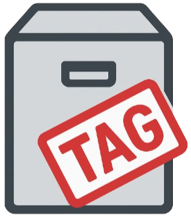

<div align="center">


# ArchiveTagger


Local-first **archive cataloging, metadata extraction, fingerprinting, taxonomy tagging, duplicate analysis, search, preview, and dataset-structuring system** for heterogeneous collections.


**Version:** 0.1.0-alpha  
**License:** MIT  
**Author:** [0xdeadbeef] of ZZX-Labs R&D  
**Language:** Python 3.11+ / PyQt5 / OpenCV / Tesseract / FFmpeg · JavaScript / Web Crypto / Canvas / IndexedDB

</div>


## What it does

- Ingests batches of local files through drag/drop or the File API
- Imports CORS-accessible HTTP(S) files by URL
- Catalogs text, code, image, audio, video, archive, and binary data
- Computes SHA-256 fingerprints for every imported file
- Computes 8×8 perceptual average hashes for images
- Extracts text from browser-readable text/code/data formats
- Extracts image dimensions
- Extracts audio/video duration when supported by the browser
- Extracts video dimensions
- Reads ZIP central-directory inventories without extracting files
- Reads TAR entry inventories without extracting files
- Applies reusable keyword taxonomy rules
- Supports manual tag editing
- Indexes filenames, tags, text, MIME types, extensions, and metadata
- Searches the catalog locally
- Detects exact duplicate groups by SHA-256
- Detects near-image pairs by perceptual-hash Hamming distance
- Previews text, images, audio, and video while source files remain in the session
- Supports OCR through Tesseract.js or a custom OCR provider
- Persists derived catalog records in IndexedDB
- Exports complete ArchiveTagger catalogs as JSON
- Exports flat archival inventories as CSV
- Exports JSONL datasets for ML/RAG/data-engineering workflows
- Imports previously exported catalog JSON
- Never persists raw source file bytes by default


## Install

### Native Python Edition

```bash
python -m venv .venv && . .venv/bin/activate
# Windows:
# .venv\Scripts\activate

pip install pyqt5 opencv-python pytesseract pillow mutagen numpy
```

Install FFmpeg separately and make it available on the system path.

Tesseract OCR must also be installed separately for the native `pytesseract` workflow.

If the native repository provides a `requirements.txt`, prefer:

```bash
pip install -r requirements.txt
```


### Web Edition

No JavaScript package installation is required.

Serve the project directory:

```bash
python -m http.server 8000
```

Then open:

```text
http://localhost:8000/
```


## Run (Web)

Deploy or serve:

```text
/projects/software/archive-tagger/
```

The browser workbench contains:

```text
Scan & Import
Catalog
Tags & Taxonomy
Search
Duplicates
Preview & Metadata
Export / Import
```


## Batch Ingestion

Local files are processed sequentially so large collections do not require every file to be loaded into memory simultaneously.

For each file ArchiveTagger records:

```text
name
size
MIME type
extension
category
last-modified timestamp
SHA-256
perceptual hash when applicable
derived metadata
extracted text
tags
source
index timestamp
```


## File Categories

The browser classifies files into:

```text
text
image
audio
video
archive
binary
```

Classification uses MIME type plus file extension.


## SHA-256 Fingerprints

Every imported file receives:

```text
SHA-256(file bytes)
```

The browser implementation uses:

```javascript
crypto.subtle.digest("SHA-256", fileBytes)
```

Exact duplicate groups are defined by identical SHA-256 digests.


## Image Perceptual Hash

Images also receive an 8×8 average hash.

Process:

```text
decode image
↓
resize to 8 × 8
↓
convert pixels to grayscale
↓
calculate mean intensity
↓
1 when pixel >= mean
0 when pixel < mean
↓
64-bit perceptual hash
```

Near-image comparisons use Hamming distance.

Current browser threshold:

```text
distance <= 6 bits
```


## Text Extraction

Browser-readable text formats include common files such as:

```text
TXT
Markdown
CSV / TSV
JSON / JSONL
XML
HTML
CSS
JavaScript
TypeScript
Python
Shell
Java
Kotlin
C / C++
Rust
Go
Ruby
PHP
Perl
Lua
SQL
YAML
TOML
INI / CFG
logs
TeX
RTF
```

The default browser text-read cap is:

```text
4 MiB per file
```

The catalog marks text as truncated when the source is larger.


## Image Metadata

Browser-native image metadata currently includes:

```text
width
height
aspect ratio
perceptual hash
```

The native edition can use Pillow/OpenCV for deeper inspection.


## Audio / Video Metadata

Browser media elements provide:

```text
duration
video width
video height
```

Availability depends on browser codec support.


## ZIP Inventory

ZIP files are read from the end-of-central-directory record and central directory.

ArchiveTagger records entry information such as:

```text
entry name
compressed size
uncompressed size
```

The browser inventory code does not extract ZIP contents onto the host filesystem.


## TAR Inventory

For uncompressed `.tar` files, ArchiveTagger reads 512-byte TAR headers and records:

```text
entry name
entry size
type flag
```

Compressed TAR variants remain categorized as archives but are not recursively expanded by the lightweight static browser edition.


## Taxonomy

A taxonomy rule is:

```text
tag
+
one or more keywords
```

Example:

```text
tag:
research

keywords:
research, paper, abstract, citation, bibliography, doi, journal
```

Rules are matched against:

```text
filename
MIME type
extension
category
extracted text
metadata JSON
```

Auto-tagging is deterministic and local.


## Search

ArchiveTagger searches:

```text
filename
tags
category
MIME type
extension
metadata
extracted text
```

Field weighting favors:

```text
filename
tags
MIME/category
metadata
text occurrences
```

A tag-only mode is also available.


## Duplicate Analysis

Exact duplicates:

```text
same SHA-256
```

Near-image pairs:

```text
different SHA-256
+
perceptual Hamming distance <= 6
```


## OCR

The static browser bundle does not embed a large OCR model.

If Tesseract.js already exists on the page:

```javascript
window.Tesseract.recognize(...)
```

ArchiveTagger detects it automatically.

A custom provider can also be registered:

```javascript
ArchiveTagger.registerOCRProvider(async ({ file, record }) => {
  return "recognized text";
}, "my-ocr");
```

OCR output becomes indexed record text and is automatically re-tagged.


## IndexedDB Persistence

Catalog metadata is stored in:

```text
IndexedDB database:
zzx-archivetagger
```

Persisted catalog data includes:

```text
metadata
hashes
tags
extracted text
archive inventories
timestamps
```

It intentionally does **not** include raw source file bytes.

After a browser reload, catalog metadata remains available but source-file previews require the original files to be reselected.


## Catalog JSON

Catalog export schema:

```text
zzx.archivetagger.catalog.v1
```

A catalog contains:

```text
records[]
taxonomy[]
exportedAt
```


## CSV Export

The flat CSV inventory includes:

```text
id
name
category
type
extension
size
sha256
perceptualHash
tags
lastModifiedIso
indexedAt
source
sourceUrl
text
```


## JSONL Dataset Export

Each line contains one structured dataset record:

```json
{
  "id": "...",
  "name": "...",
  "sha256": "...",
  "category": "text",
  "mime": "text/plain",
  "tags": ["research"],
  "text": "...",
  "metadata": {}
}
```

This is suitable for:

```text
ML dataset preparation
RAG ingestion
research corpora
data engineering
digital-preservation pipelines
```


---

## Directory layout

```text
archive-tagger/
├─ index.html
├─ style.css
├─ script.js
├─ archivetagger.js
├─ archive-core.js
├─ archive-store.js
├─ metadata.js
├─ tagger.js
├─ search.js
├─ ocr.js
├─ hook.css
├─ hook.js
├─ manifest.json
├─ README.md
└─ logo.png
```


---

## JavaScript API

The primary browser module is:

```javascript
window.ArchiveTagger
```

Core methods:

```javascript
ArchiveTagger.addFile(file)
ArchiveTagger.addFiles(files)

ArchiveTagger.search(query, options)
ArchiveTagger.duplicateAnalysis()

ArchiveTagger.registerOCRProvider(provider, name)

ArchiveTagger.getRecord(id)
ArchiveTagger.getRecords()

ArchiveTagger.exportCatalog()
ArchiveTagger.importCatalog(catalog)

ArchiveTagger.getState()
```


## Internal Modules

Catalog engine:

```javascript
window.ArchiveTaggerCore
```

Persistent metadata store:

```javascript
window.ArchiveTaggerStore
```

Metadata/fingerprinting:

```javascript
window.ArchiveTaggerMetadata
```

Taxonomy:

```javascript
window.ArchiveTaggerTaxonomy
```

Search:

```javascript
window.ArchiveTaggerSearch
```

OCR adapter:

```javascript
window.ArchiveTaggerOCR
```


---

## Privacy

By default, local imported files are not uploaded.

Network access occurs only when the user explicitly chooses:

```text
Import URL
```

or registers an OCR/external provider that performs network operations.


---

## Notes

The native edition can use:

```text
OpenCV
Pillow
Tesseract
FFmpeg
Mutagen
SQLite
NumPy
```

for deeper media metadata, OCR, and archival workflows.

The static browser edition provides a functional local-first catalog, fingerprinting, tagging, indexing, duplicate-analysis, preview, and export workflow without requiring those native dependencies.


---

## Usage quickstart

- **Add files**: `Scan & Import` → `SELECT FILES` or drag/drop
- **Inspect catalog**: `Catalog`
- **Define taxonomy**: `Tags & Taxonomy`
- **Auto-tag everything**: `AUTO-TAG ALL`
- **Search**: `Search` → enter query
- **Duplicates**: `Duplicates` → `REFRESH ANALYSIS`
- **Preview**: select a catalog row
- **OCR image**: select image → `OCR SELECTED IMAGE`
- **Export preservation catalog**: `Export / Import` → `EXPORT JSON`
- **Export spreadsheet inventory**: `EXPORT CSV`
- **Export ML/RAG dataset**: `EXPORT JSONL`
