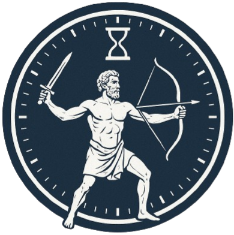

<div align="center">


# Astral Clock

**Universal Time System**

A multi-body time and relativity workstation for comparing Earth, Moon, Mars, Ganymede, and custom celestial reference clocks, including modeled proper-time drift and light-speed signal delay.

**Version:** 0.1.0-alpha  
**License:** MIT  
**Author:** [0xdeadbeef] of ZZX-Labs R&D  
**Language:** Python / PyQt5 / Astropy / NumPy / SciPy · JavaScript / Canvas / Date-Time

## What it does

- Displays a live Earth UTC reference clock.
- Displays modeled Moon, Mars, and Ganymede surface-clock readings.
- Anchors the browser model to a shared epoch.
- Calculates weak-field gravitational clock-rate terms.
- Calculates first-order special-relativistic velocity terms.
- Compares pairwise clock rates.
- Projects accumulated drift over days, years, decades, or centuries.
- Converts modeled clock timestamps between supported bodies.
- Calculates one-way and round-trip light-time from distance.
- Provides representative body-pair distance presets.
- Runs accelerated 0–500 year drift simulations.
- Plots drift evolution with Canvas.
- Exposes the physical constants and reference-body table.
- Supports a temporary user-defined celestial body.
- Requires no network access for the supplied browser model.

## Install

### Native Python Edition

```bash
python -m venv .venv && . .venv/bin/activate
# Windows: .venv\Scripts\activate

pip install pyqt5 numpy astropy scipy matplotlib requests pillow
```

### Web Edition

No package installation is required.

```bash
python -m http.server 8000
```

Then open the served project directory.

## Run (Web)

Deploy under:

```text
/projects/software/astral-clock/
```

Workbench:

```text
Universal Clock
Time Converter
Drift & Relativity
Signal Delay
Simulation
Celestial Bodies
Model
```

## Coordinate-time convention

Relativity does not define a single observer-independent universal present across arbitrary spacetime.

The browser edition therefore treats Astral Clock as an explicit coordinate-time convention anchored to:

```text
Reference clock:
Earth UTC

Reference epoch:
2026-01-01T00:00:00.000Z
```

Other body clocks are modeled as proper-time rates relative to that reference.

## Weak-field model

The browser approximation uses:

```text
dτ/dt ≈ 1 - GM/(r c²) - v²/(2 c²)
```

where:

```text
G = 6.67430×10⁻¹¹ m³ kg⁻¹ s⁻²
c = 299,792,458 m/s
M = body mass
r = body radius
v = modeled combined velocity
```

The implementation combines surface rotational speed and a representative external/orbital speed by Euclidean magnitude.

## Rotation speed

For radius `r` and rotation period `T`:

```text
v_rotation = 2πr / T
```

## Relative clock rate

Earth is the reference rate.

For body `B`:

```text
relative_rate(B) = rate(B) / rate(Earth)
```

## Clock mapping

For Earth-coordinate timestamp `t` and shared epoch `t0`:

```text
τ_B(t) = t0 + (t - t0) × relative_rate(B)
```

The inverse mapping is:

```text
t = t0 + (τ_B - t0) / relative_rate(B)
```

## Drift

For bodies `A` and `B` over coordinate duration `Δt`:

```text
drift = (relative_rate(A) - relative_rate(B)) × Δt
```

The browser UI formats very small drift values in:

```text
ns
µs
ms
s
minutes
hours
days
```

## Signal delay

The browser uses the defined speed of light:

```text
c = 299,792.458 km/s
```

One-way signal time:

```text
t = distance / c
```

Round-trip signal time:

```text
RTT = 2 × distance / c
```

Representative preset distances are convenience values, not real-time ephemerides.

## Celestial bodies

Built-in browser model:

```text
Earth
Moon
Mars
Ganymede
```

Each record contains:

```text
mass
mean/reference radius
rotation period
representative external velocity
representative reference distance
```

## Custom body

The UI can add one temporary custom body with:

```text
name
mass
radius
rotation period
external/orbital velocity
reference distance
```

The custom body immediately becomes available in conversion, drift, and signal-delay selectors.

## Simulation

The accelerated simulation spans:

```text
0–500 Julian years
```

and plots accumulated Moon/Earth, Mars/Earth, and Ganymede/Earth drift.

## Precision boundary

The static browser model does not attempt to reproduce all Astropy or precision-navigation behavior.

It does not include:

```text
full relativistic metric integration
real-time JPL ephemerides
Shapiro delay
atmospheric propagation delay
spacecraft trajectory state vectors
high-order gravitational harmonics
observer-dependent simultaneity surfaces
precision TT / TCG / TCB / TDB transformations
```

The native Astropy-based project is the appropriate path for deeper astronomical time-scale and ephemeris work.

---

## Directory layout

```text
astral-clock/
├─ index.html
├─ style.css
├─ script.js
├─ astral-clock.js
├─ celestial.js
├─ time-model.js
├─ hook.css
├─ hook.js
├─ manifest.json
├─ README.md
└─ logo.png
```

---

## JavaScript API

Main API:

```javascript
window.AstralClock
```

Methods:

```javascript
AstralClock.bodies()
AstralClock.rate(bodyId)
AstralClock.relativeRate(bodyId)

AstralClock.convert(timestampMs, fromId, toId)
AstralClock.driftSeconds(aId, bId, durationSeconds)
AstralClock.signalDelaySeconds(distanceKm)

AstralClock.addCustomBody(params)
AstralClock.getState()
```

Physical model:

```javascript
window.AstralTimeModel
```

Body data:

```javascript
window.AstralBodies
```

---

## Privacy

The supplied browser edition performs all calculations locally.

No network connection is required.

---

## Usage quickstart

- **Live clocks:** open `Universal Clock`.
- **Convert time:** choose source/target → `CONVERT`.
- **Compare drift:** choose two bodies → `CALCULATE DRIFT`.
- **Signal latency:** choose bodies → load preset or enter distance → `CALCULATE`.
- **Simulate centuries:** move the year slider.
- **Inspect constants:** `Celestial Bodies`.
- **Add a body:** enter custom parameters → `ADD / UPDATE CUSTOM BODY`.
