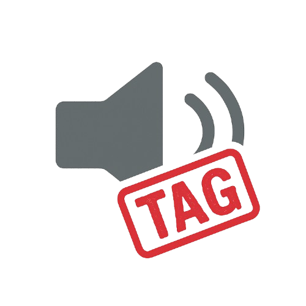

<div align="center">


# AudioTagger

Automated **audio metadata tagging, normalization, cataloging, fingerprinting, cleanup, recognition integration, and export engine** for music libraries and archival collections.

**Version:** 0.1.0-alpha  
**License:** MIT  
**Author:** [0xdeadbeef] of ZZX-Labs R&D  
**Language:** Python / PyQt5 / Mutagen / FFmpeg / Beets · JavaScript / Web Audio / Web Crypto / IndexedDB

## What it does

- Imports large batches of local audio files.
- Extracts common ID3v2 metadata.
- Falls back to ID3v1 for older MP3 files.
- Extracts FLAC STREAMINFO and Vorbis-comment metadata.
- Computes full-file SHA-256 fingerprints.
- Computes deterministic decoded-audio summary fingerprints when Web Audio can decode the file.
- Maintains embedded and normalized catalog metadata as separate layers.
- Provides manual tag editing.
- Provides deterministic batch cleanup rules.
- Supports filename-to-title fallback.
- Supports conservative title-case normalization.
- Supports genre separator normalization and deduplication.
- Detects exact duplicates by SHA-256.
- Persists metadata and fingerprints in IndexedDB.
- Provides an explicit online-recognition provider interface.
- Exports AudioTagger catalogs as JSON.
- Exports human-readable YAML.
- Exports flat CSV inventories.
- Exports per-track sidecar JSON.
- Imports previous AudioTagger catalog JSON.
- Does not rewrite source audio files in the static browser edition.

## Install

### Native Python Edition

```bash
python -m venv .venv && . .venv/bin/activate
# Windows:
# .venv\Scripts\activate

pip install pyqt5 mutagen ffmpeg-python requests beets pillow
```

Install FFmpeg separately for the native FFmpeg workflow.

### Web Edition

No JavaScript package installation is required.

```bash
python -m http.server 8000
```

Then open the served project directory.

## Run (Web)

Deploy under:

```text
/projects/software/audio-tagger/
```

Workbench:

```text
Batch Import
Catalog & Edit
Normalize & Clean
Fingerprints
Recognition
Export / Import
```

## Metadata layers

The browser edition keeps source and catalog metadata separate:

```text
embeddedTags
catalogTags
```

Effective tags are:

```text
embeddedTags + catalogTags override
```

This mirrors a non-destructive Beets/Mutagen-style workflow while avoiding arbitrary in-place binary tag mutation in the browser.

## MP3 metadata

Common ID3v2 frames parsed include:

```text
TIT2 title
TPE1 artist
TALB album
TPE2 album artist
TCON genre
TRCK track
TDRC/TYER date/year
TCOM composer
COMM comment
```

ID3v1 is used as a fallback when available.

## FLAC metadata

The browser parser reads:

```text
STREAMINFO
Vorbis comments
```

Common keys include:

```text
TITLE
ARTIST
ALBUM
ALBUMARTIST
GENRE
TRACKNUMBER
DATE
COMPOSER
COMMENT
```

## SHA-256 fingerprint

Every imported file receives:

```text
SHA-256(file bytes)
```

through the Web Crypto API.

This fingerprint is appropriate for exact file identity and duplicate grouping.

## Acoustic summary fingerprint

When a browser can decode the source, AudioTagger also computes:

```text
ATG1-PCM-SUMMARY-SHA256
```

The browser algorithm:

```text
decode audio
↓
sample approximately 8 kHz worth of points
↓
divide into 0.5 second analysis frames
↓
calculate frame RMS
calculate frame peak
calculate frame zero-crossing ratio
↓
quantize feature vector
↓
SHA-256(feature signature)
```

This is a deterministic AudioTagger browser summary fingerprint.

It is not presented as AcoustID, Chromaprint, or another external fingerprint standard.

## Normalization

Current browser cleanup rules:

```text
trim leading/trailing whitespace
collapse repeated whitespace
filename stem fallback for missing title
optional conservative title case
genre separator normalization
duplicate genre removal
```

Cleanup can be previewed before application.

## Recognition provider

The static page does not ship credentials or fabricate recognition results.

Register a provider:

```javascript
AudioTagger.registerRecognitionProvider(
  async ({ record, file }) => {
    // Call your recognition service here.
    return {
      title: "Recognized title",
      artist: "Recognized artist",
      album: "Recognized album",
      source: "my-provider",
      confidence: 0.98
    };
  },
  "my-provider"
);
```

The provider receives:

```text
catalog record
local File handle when still available
SHA-256 fingerprint
acoustic summary fingerprint
existing metadata
```

A provider may use a network, but the core page itself does not require one.

## IndexedDB

Persistent database:

```text
zzx-audio-tagger
```

Stored data:

```text
filename
file size
duration
embedded tags
catalog tags
raw parsed tags
SHA-256
acoustic fingerprint
recognition result metadata
index timestamp
```

Raw audio bytes are not persisted.

After page reload, catalog records remain but local `File` handles must be reselected for provider workflows that require source bytes.

## JSON catalog

Schema:

```text
zzx.audio-tagger.catalog.v1
```

## Sidecar JSON

Schema:

```text
zzx.audio-tagger.sidecar.v1
```

## YAML export

The browser includes a local YAML serializer for AudioTagger's catalog object.

No third-party YAML runtime is required.

## CSV export

The flat inventory includes:

```text
filename
title
artist
album
album artist
genre
track
year
duration
extension
SHA-256
acoustic fingerprint
```

---

## Directory layout

```text
audio-tagger/
├─ index.html
├─ style.css
├─ script.js
├─ audio-tagger.js
├─ metadata.js
├─ fingerprint.js
├─ catalog-store.js
├─ recognition.js
├─ hook.css
├─ hook.js
├─ manifest.json
├─ README.md
└─ logo.png
```

---

## JavaScript API

Primary browser API:

```javascript
window.AudioTagger
```

Methods:

```javascript
AudioTagger.addFiles(files)

AudioTagger.getRecords()
AudioTagger.getRecord(id)

AudioTagger.normalizePreview(id)

AudioTagger.registerRecognitionProvider(provider, name)

AudioTagger.exportCatalog()
AudioTagger.importCatalog(value)

AudioTagger.getState()
```

Supporting modules:

```javascript
window.AudioTaggerMetadata
window.AudioTaggerFingerprint
window.AudioTaggerStore
window.AudioTaggerRecognition
```

---

## Privacy

The supplied static browser edition does not upload imported audio files.

Recognition is inert until an explicit provider is registered.

---

## Usage quickstart

- **Import library:** `Batch Import` → `SELECT AUDIO`.
- **Inspect/edit tags:** select a track in `Catalog & Edit`.
- **Preview cleanup:** `Normalize & Clean` → `PREVIEW CHANGES`.
- **Apply cleanup:** `APPLY TO CATALOG`.
- **Inspect fingerprints:** select track → `Fingerprints`.
- **Connect recognition:** register a provider → `Recognition`.
- **Save catalog:** `Export / Import` → JSON, YAML, or CSV.
