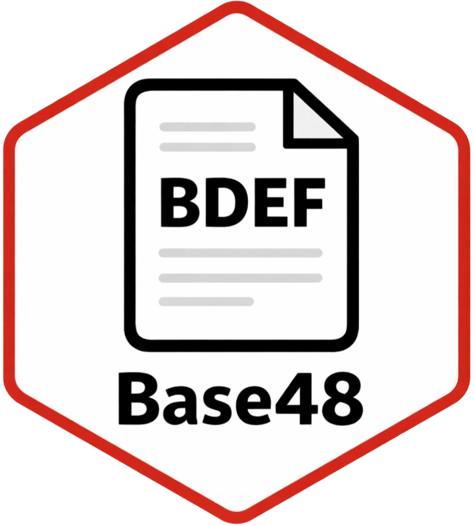

<div align=center>


# Base48

Deterministic binary-to-text encoding derived from Bitcoin's Base58 alphabet.

**Version:** 1.0.0  
**License:** MIT  
**Author:** [0xdeadbeef] of ZZX-Labs R&D

</div>


## Main title

The user-facing title is simply:

```text
Base48
```

The deployment slug remains:

```text
base48-bdef
```

## Canonical alphabet

Bitcoin Base58:

```text
123456789ABCDEFGHJKLMNPQRSTUVWXYZabcdefghijkmnopqrstuvwxyz
```

Remove:

```text
C c S s P p A a M m
```

Resulting 48-character alphabet:

```text
123456789BDEFGHJKLNQRTUVWXYZbdefghijknoqrtuvwxyz
```

## Codec behavior

The browser implementation encodes arbitrary byte arrays using base conversion through JavaScript `BigInt`.

Leading zero bytes are preserved using the first alphabet character:

```text
1
```

This follows the familiar Base58-style leading-zero convention.

## Browser features

```text
UTF-8 → Base48
Base48 → UTF-8

hex bytes → Base48
Base48 → hex bytes

local file → Base48 text
Base48 text → downloadable binary

canonical alphabet validation
invalid-character reporting
decoded-length inspection
reproducible test vectors
```

## Deployment

Extract directly into:

```text
/projects/software/base48-bdef/
```

No logo work is included in this archive. If desired, add:

```text
/projects/software/base48-bdef/logo.png
```

later.

## Files

```text
index.html
style.css
script.js
base48-bdef.js
codec.js
hook.css
hook.js
manifest.json
README.md
```

## JavaScript API

```javascript
window.Base48
```

Methods:

```javascript
Base48.encode(bytes)
Base48.decode(text)

Base48.encodeText(text)
Base48.decodeText(text)

Base48.hexToBytes(hex)
Base48.bytesToHex(bytes)

Base48.inspect(text)
```

Alphabet:

```javascript
Base48.alphabet
```

## Network

No network connection is required.
