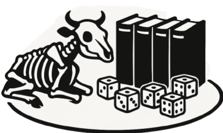

<div align="center">


# beef's Diceware Wordlists

Cryptographically signed, locale-aware Diceware wordlist tooling.

**Version:** 1.0.0  
**License:** MIT  
**Author:** [0xdeadbeef] of ZZX-Labs R&D

</div>


## Browser edition

The page validates an externally supplied Diceware list rather than silently substituting an unofficial one.

Required list structure:

```text
11111 word
11112 word
...
66666 word
```

A complete list must contain exactly 7,776 unique codes and 7,776 unique words.

Features:

```text
7,776-entry coverage validation
SHA-256 hashing
Ed25519 detached-signature verification
crypto.getRandomValues d6 emulation
manual five-dice code resolution
entropy calculation
physical-dice frequency / Shannon / chi-square audit
normalized text export
print-friendly wordlist
```

Entropy per uniform Diceware word:

```text
log2(7776) ≈ 12.925 bits
```

## Deployment

Extract directly into:

```text
/projects/software/beefs-diceware-wordlists/
```

## JavaScript API

```javascript
window.BeefsDiceware
BeefsDiceware.loadText(text)
BeefsDiceware.generate(count)
BeefsDiceware.auditRolls(text)
BeefsDiceware.getState()
```
